## Time Complexity

- Imagine a classroom of 100 students in which you gave your pen to one person. Now, you want that pen. Here are some
  ways to find the pen and what the O order is.
    - O(n2): You go and ask the first person of the class, if he has the pen. Also, you ask this person about other 99
      people in the classroom if they have that pen and so on, This is what we call O(n2).
    - O(n): Going and asking each student individually is O(N).
    - O(log n): Now I divide the class into two groups, then ask: “Is it on the left side, or the right side of the
      classroom?” Then I take that group and divide it into two and ask again, and so on. Repeat the process till you
      are left with one student who has your pen. This is what you mean by O(log n).
    - I might need to do the O(n2) search if only one student knows on which student the pen is hidden. I’d use the O(n)
      if one student had the pen and only they knew it. I’d use the O(log n) search if all the students knew, but would
      only tell me if I guessed the right side.

#### Prerequisite

- Understanding of Logarithms

### Logarithms

Logarithm is the way to represent exponential expression as shown in the example .

- ay = x is a exponential expression, it can also be written as loga x = y
- 25 = 32, can be written as log232 = 5
- logx N , It means how many time N should be divided by x to make it 1.

### Arithmetic Progression(AP)

An arithmetic progression (AP) is a sequence where the differences between every two consecutive terms are the same.
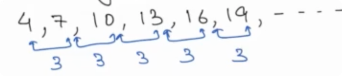
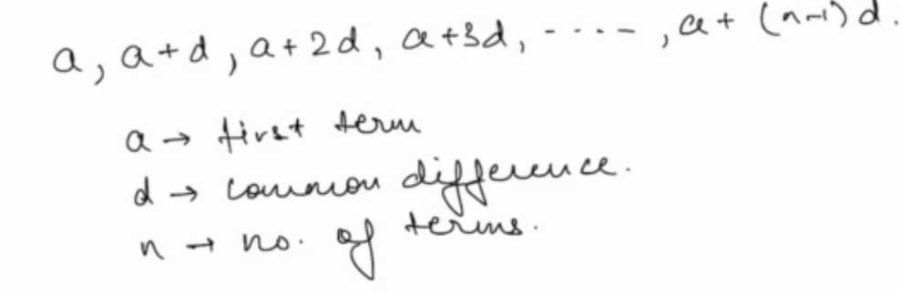

**nth term of an AP:**:

- an = a + (n - 1)d

**Sum of N term in AP**
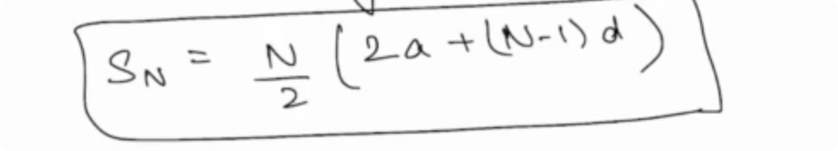

### Geometric Progression(AP)

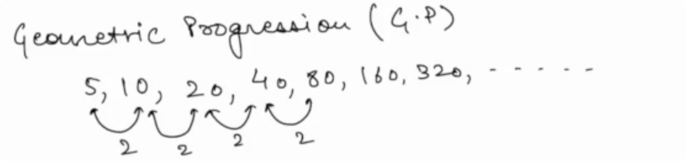
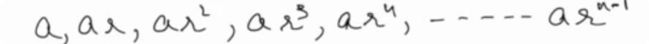
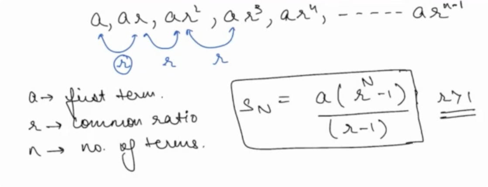

## Problems

- Problem 1
    - 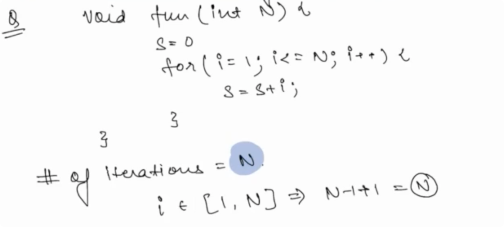
- Problem 2
    - 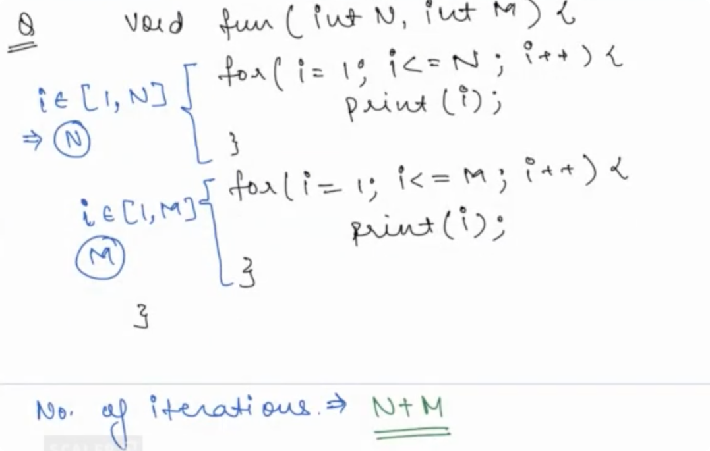
- Problem 3
    - 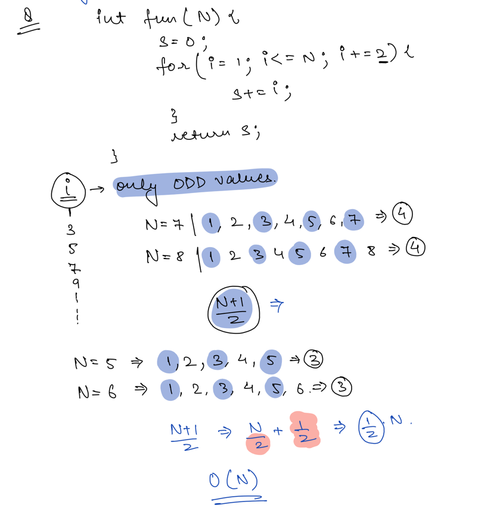
- Problem 4
    - 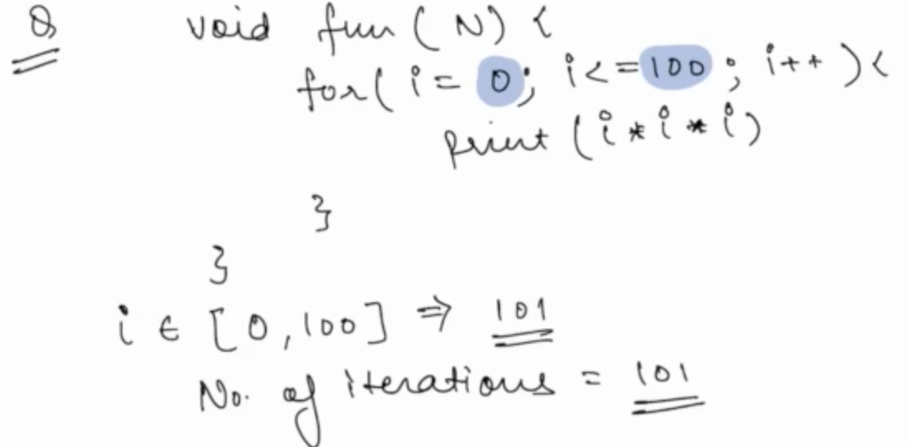
- Problem 5
    - 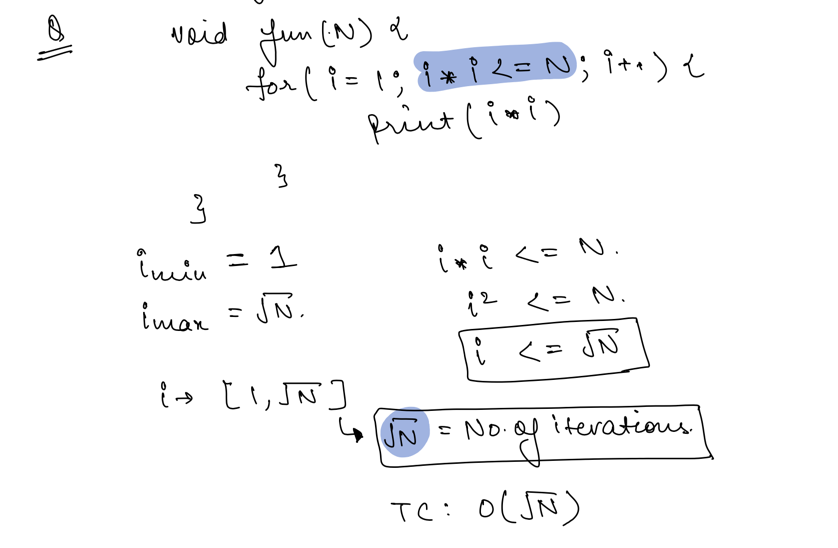
- Problem 6
    - 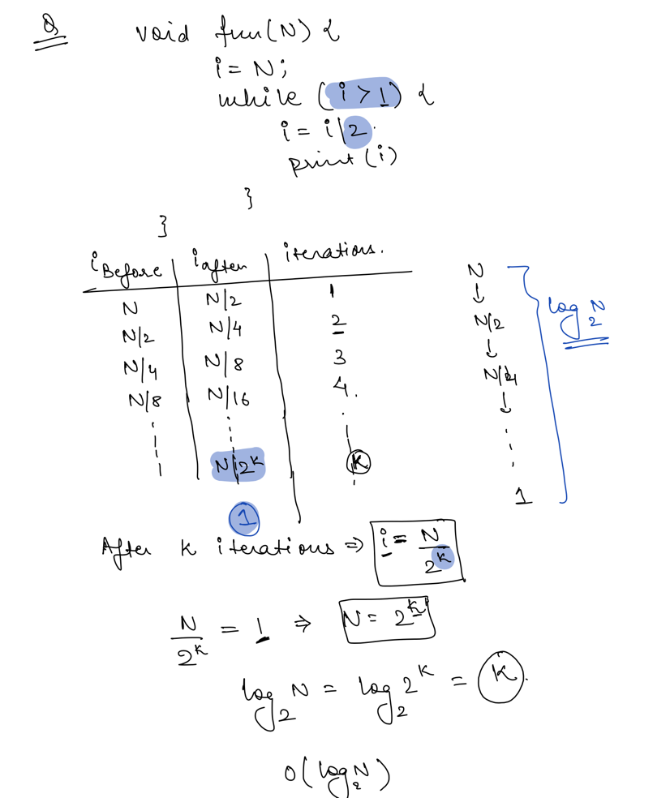
- Problem 7
    - 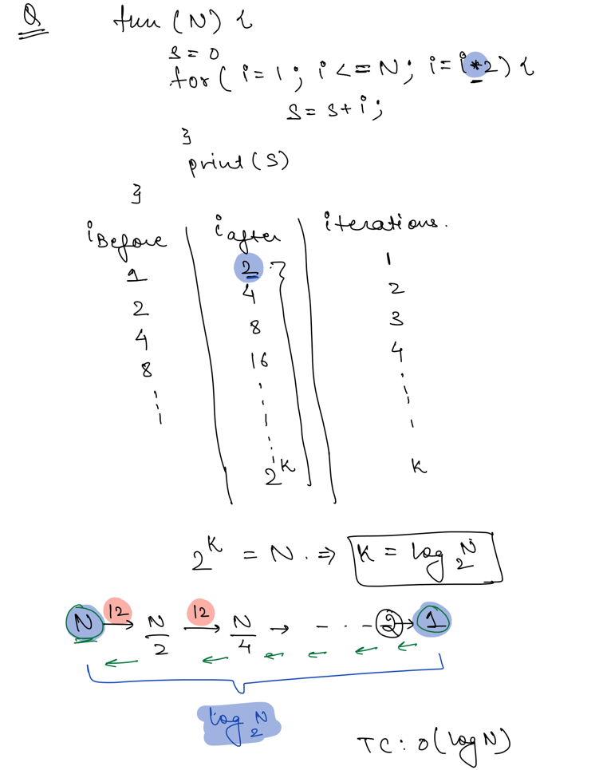
- Problem 8
    - 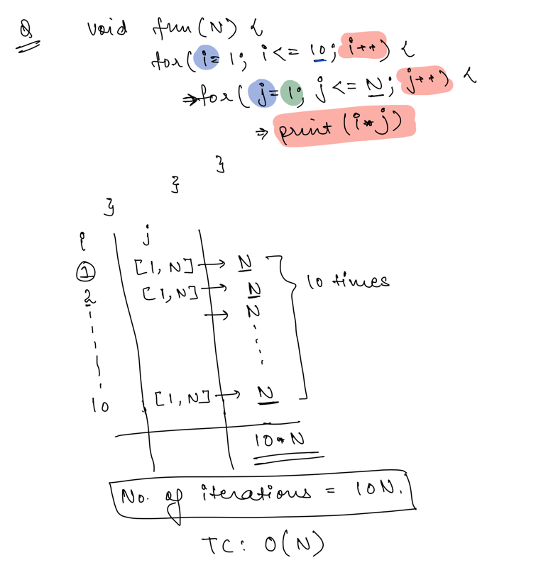
- Problem 9
    - 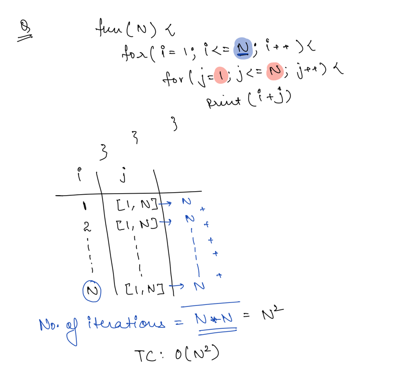
- **Problem 10**
    - 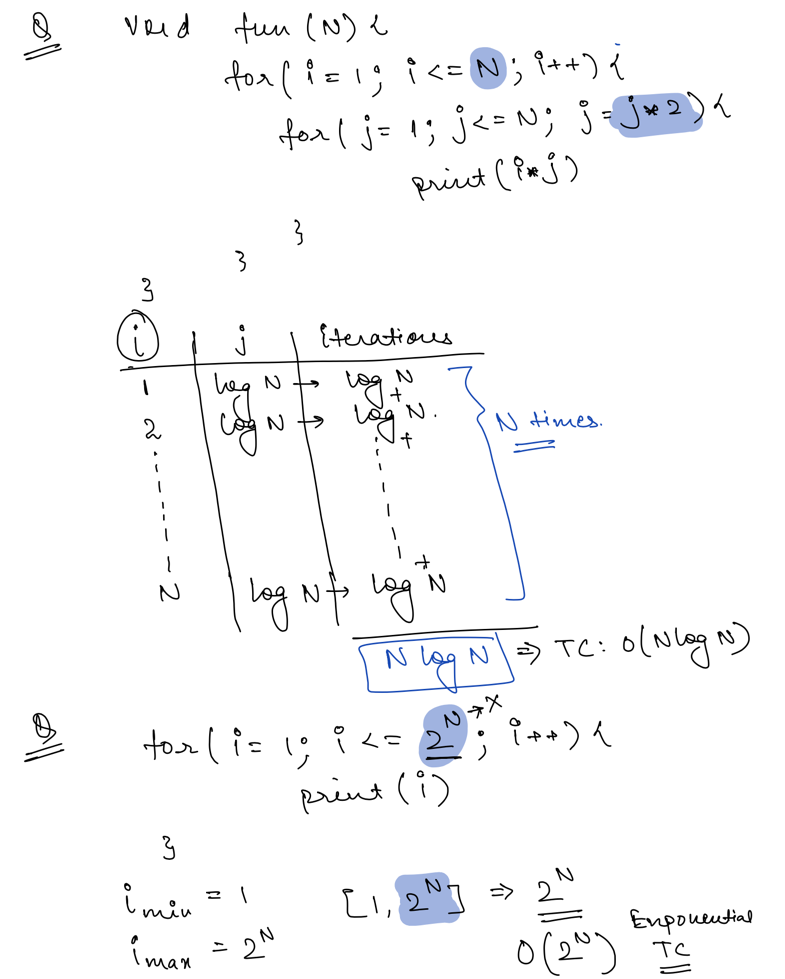
- **Problem 11**
    - 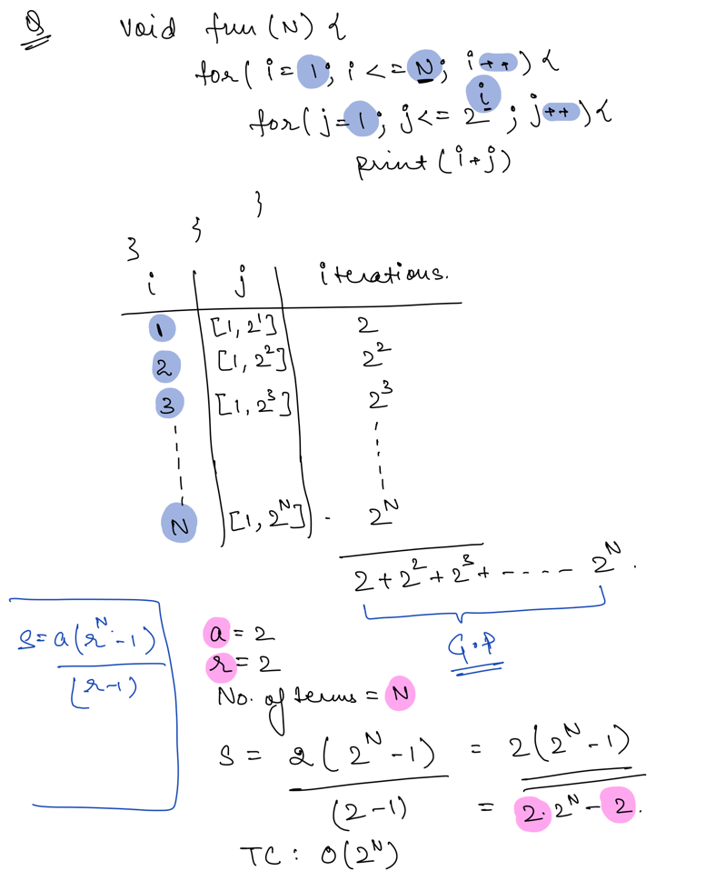

## How to calculate Big O

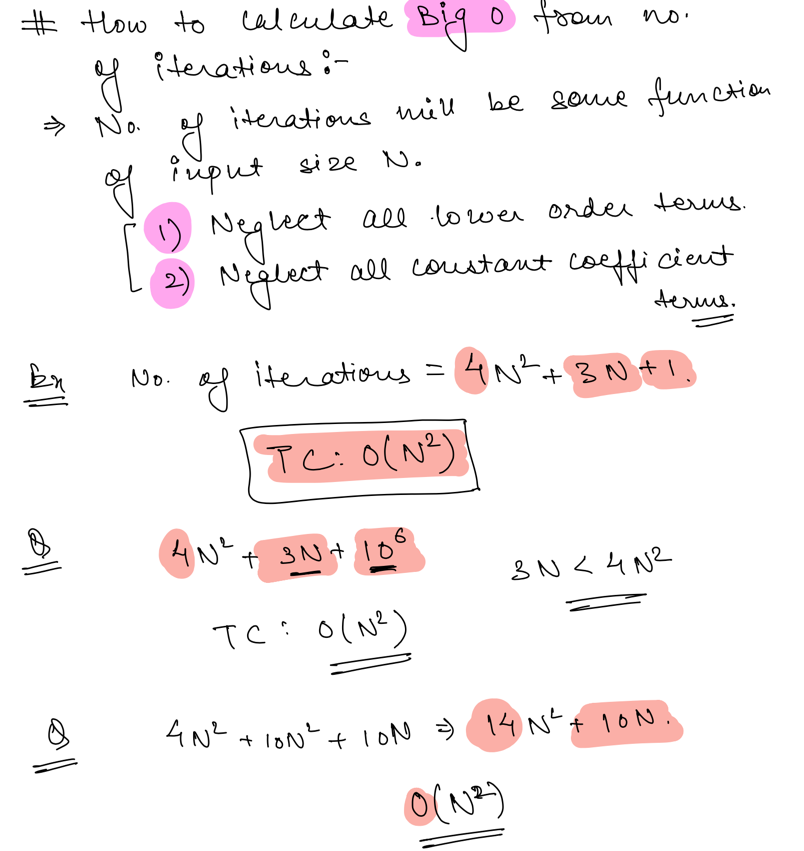
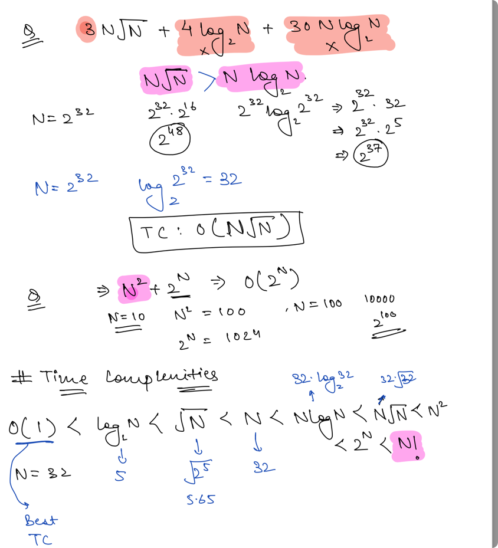

## Tips & Tricks

- [a,b] -> Including a & b. Number of Terms - `b-a+1`
- (a,b) -> Excluding a & b.
- For Big O Notation
    - Ignore all lower order terms
    - Ignore all constant coefficient terms.
    - Draw Table if you are confused with finding Big T.C