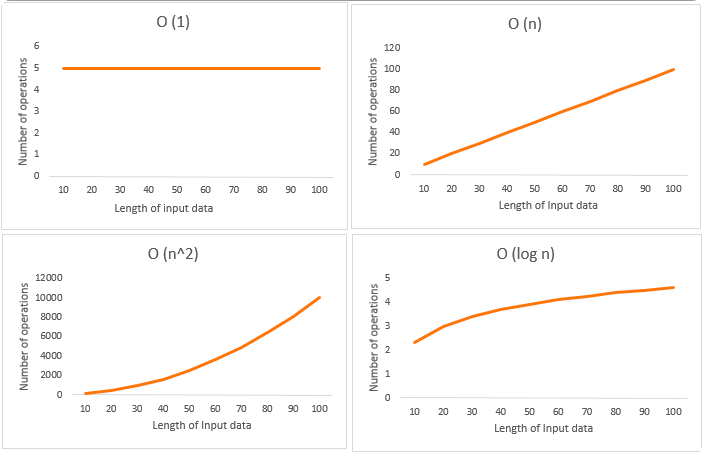
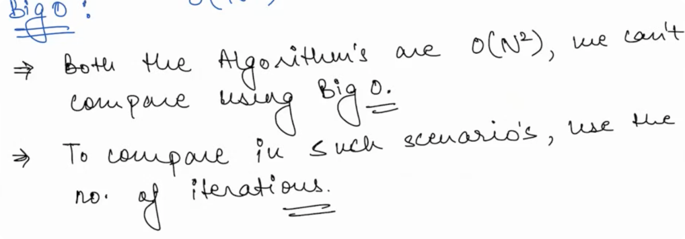
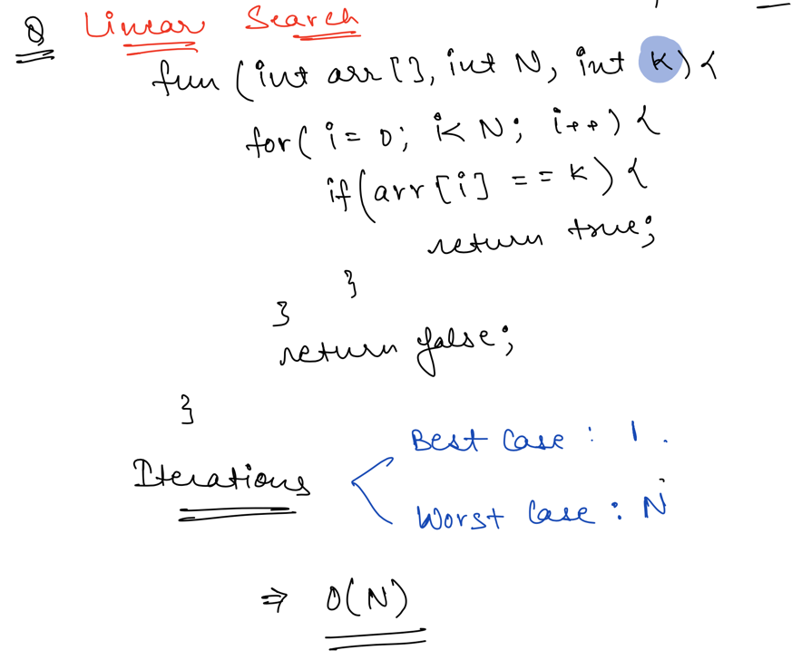
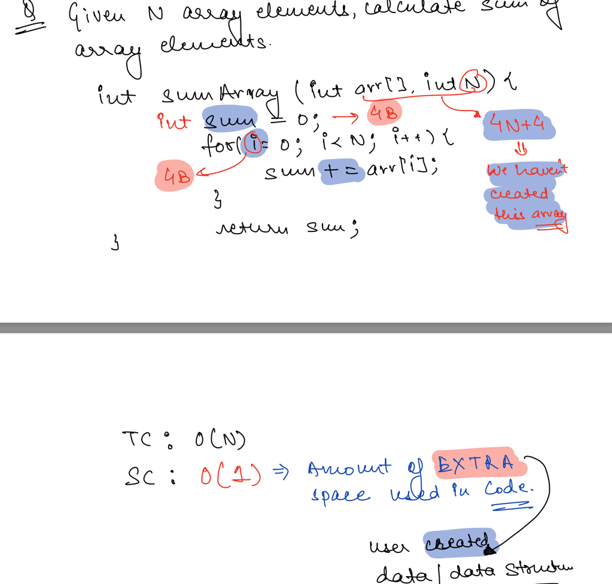
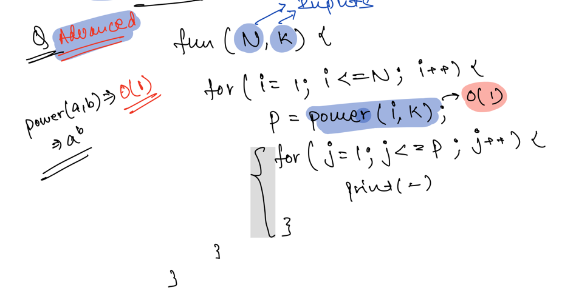
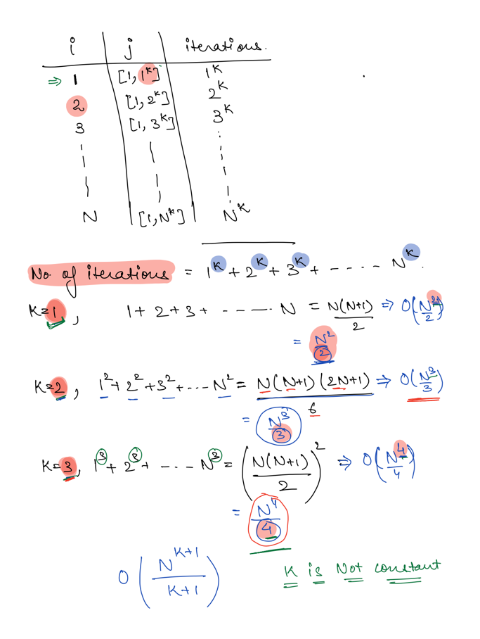

## Time & Space Complexity with Big(O) Notation - Asymptotic Analysis

**Time complexity** is the amount of time taken by an algorithm to run, as a function of the length of the input. It
measures the time taken to execute each statement of code in an algorithm.

**Space and Time** define any physical object in the Universe. Similarly, _**Space and Time complexity**_ can define the
effectiveness of an algorithm.

While we know there is more than one way to solve the problem in programming, knowing how the algorithm works
efficiently can add value to the way we do programming. To find the effectiveness of the program/algorithm, knowing how
to evaluate them _using Space and Time complexity can make the program behave in required optimal conditions_, and by
doing so, it makes us **efficient programmers**.

### Type of TimeComplexity

1. Constant time – O (1)
2. Linear time – O (n)
3. Logarithmic time – O (log n)
4. Quadratic time – O (n^2)
5. Cubic time – O (n^3)
6. Complex notations like Exponential time, Quasilinear time, factorial time, etc. are used based on the type of
   functions defined.



### Asymptotic Analysis

Performance of your Algorithm for very large input, used to describe the running time of an algorithm - how much time an
algorithm takes with a given input, n.

- Big O
- Omega (Ω)
- Theta (Θ)



### Space Complexity

Used to determine the extra space used in a Program.

- Char - 1 Byte
- Float - 4 Bytes
- Int - 4Bytes
- Long - 8Bytes
- double - 8Bytes

```java
        Size of char:1byte
        Size of int:4bytes
        Size of short int:2bytes
        Size of long int:8bytes
        Size of signed long int:8bytes
        Size of unsigned long int:8bytes
        Size of float:4bytes
        Size of double:8bytes
        Size of wchar_t:4bytes
```

- Linear Search
  
- Problem 1
  
- Problem 2(_Advanced_)
  
  

### Time Limit Exceeded(TLE)

Your Code is taking more than expected time.
**Solution:** Reduce number of Iterations(_Optimization_)

### Tips & Tricks

- Use https://www.desmos.com/calculator for graphical view
- It doesnt matter where your code in running (env, devices), We can say that it is right to compare the number of
  iterations instead of execution time. as number of iteration is going to stay the same across env, devices.