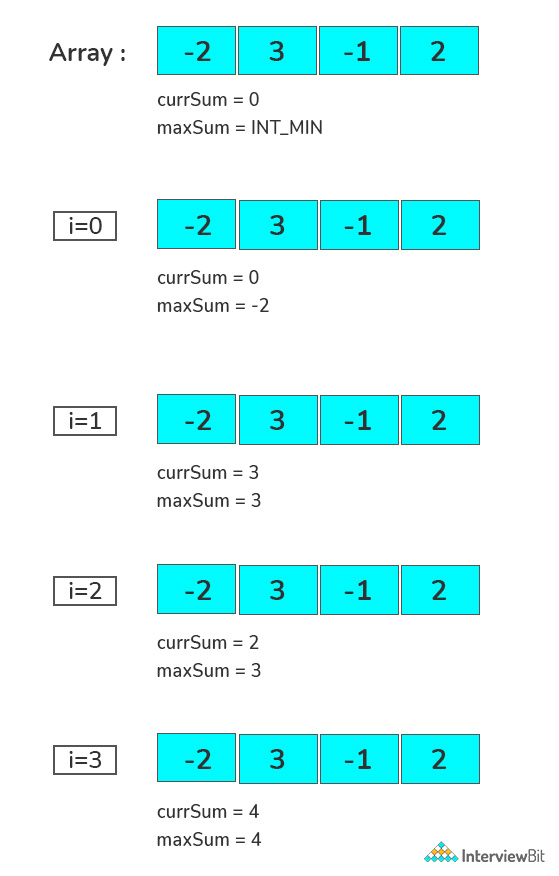

## Problem Statement - Maximum Subarray Sum
Subarrays are arrays inside another array which only contains contiguous elements.

Given an array of integers, the task is to find the maximum subarray sum possible of all the non-empty subarrays.




#### Example:
```java
Input: [-3, -4, 5, -1, 2, -4, 6, -1]
Output: 8
Explanation: Subarray [5, -1, 2, -4, 6] is the max sum contiguous subarray with sum 8.

Input: [-2, 3, -1, 2]
Output: 4
Explanation: Subarray [3, -1, 2] is the max sum contiguous subarray with sum 4.

```
We would be solving the problem by following approaches –

- Simple approach
- Efficient Approach: Kadane’s Algorithm

### Kadane’s Algorithm is an iterative dynamic programming algorithm. 

It calculates the maximum sum subarray ending at a particular position by using the maximum sum subarray ending at the previous position. Follow the below steps to solve the problem.

- Define two-variable currSum which stores maximum sum ending here and maxSum which stores maximum sum so far.
- Initialize currSum with 0 and maxSum with INT_MIN.
- Now, iterate over the array and add the value of the current element to currSum and check
  - If currSum is greater than maxSum, update maxSum equals to currSum.
  - If currSum is less than zero, make currSum equal to zero.
- Finally, print the value of maxSum.


