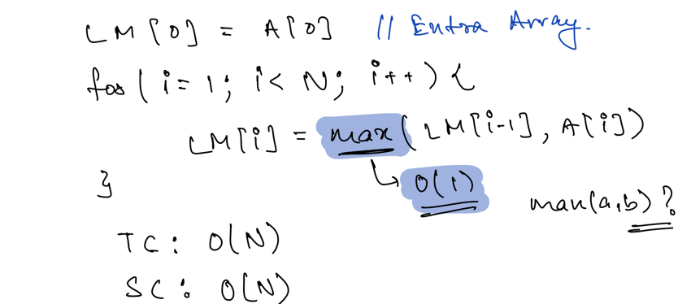
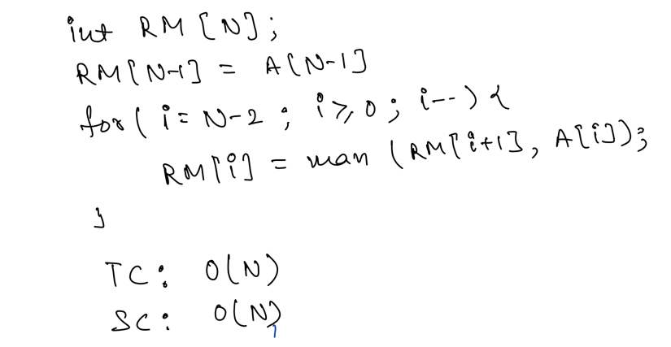
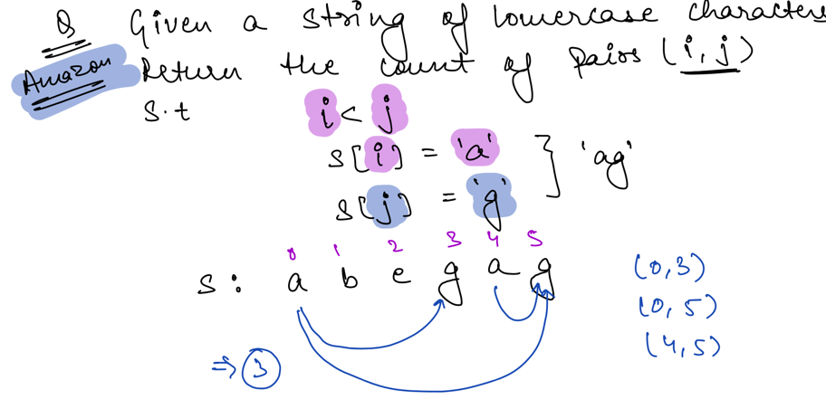
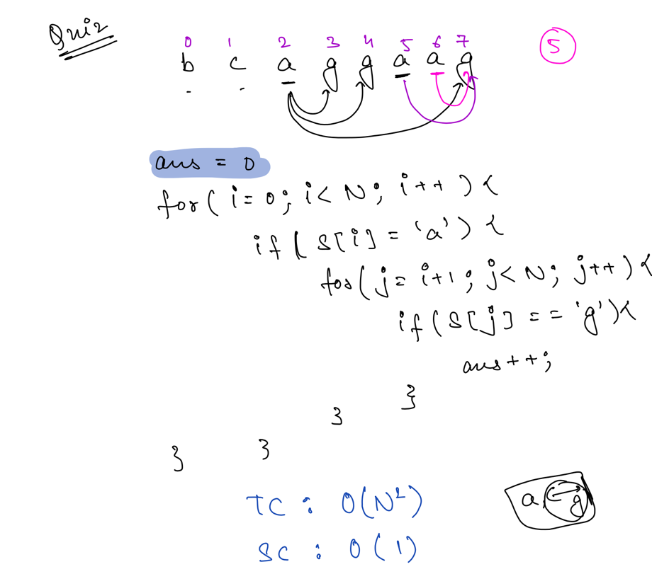
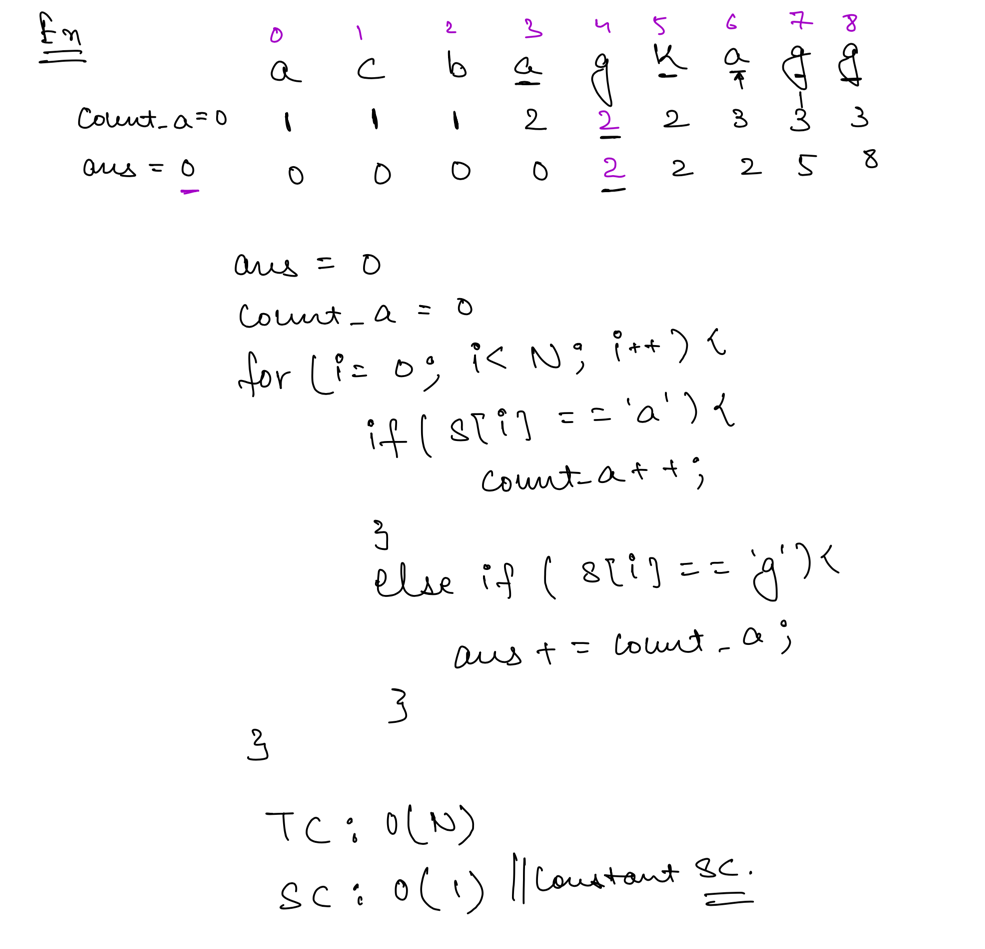
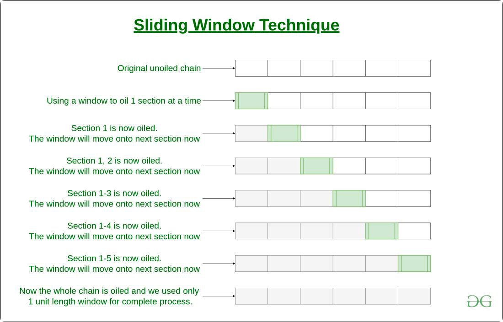

## Arrays - Carry Forward

Carry forward technique on array is used when we want to skip any element of the array while performing some operations.

### Example:

- PS Odd
- PS Even
- Left Max Array(Maximum of all values in the given array from index 0 to i )
- Right Max Array(Maximum of all Values in the given array from i to N-1) [i,N-1]

**Left Max:**

**Right Max:**


### PROBLEM 1


**Bruteforce:**

**Optimized Solution:**


## Window Sliding Technique

Window Sliding Technique is a computational technique which aims to reduce the use of nested loop and replace it with a
single loop, thereby reducing the time complexity.

### What is Sliding Window?

Consider a long chain connected together. Suppose you want to apply oil in the complete chain with your hands, without
pouring the oil from above. One way to do so is to is to:

- pick some oil,
- apply onto a section of chain,
- then again pick some oil
- then apply it to the next section where oil is not applied yet
- and so on till the complete chain is oiled.

Another way to do so, is to use a cloth, dip it in oil, and then hold onto one end of the chain with this cloth. Then
instead of re-dipping it again and again, just slide the cloth with hand onto the next section, and next, and so on till
the other end.

The second way is known as the **Sliding window technique** and the portion which is slided from one end to end, is
known as **Sliding Window**.



### Prerequisite to use Sliding window technique

The use of Sliding Window technique can be done in a very specific scenario, where the size of window for computation is
fixed throughout the complete nested loop. Only then the time complexity can be reduced.

### How to use Sliding Window Technique?

The general use of Sliding window technique can be demonstrated as following:

1. Find the size of window required
2. Compute the result for 1st window, i.e. from start of data structure
3. Then use a loop to slide the window by 1, and keep computing the result window by window.

### Example:

- Given an array of integers of size ‘n’, Our aim is to calculate the maximum sum of ‘k’ consecutive elements in the
  array.

```text
Input  : arr[] = {100, 200, 300, 400}, k = 2
Output : 700

Input  : arr[] = {1, 4, 2, 10, 23, 3, 1, 0, 20}, k = 4
Output : 39
We get maximum sum by adding subarray {4, 2, 10, 23} of size 4.

Input  : arr[] = {2, 3}, k = 3
Output : Invalid
There is no subarray of size 3 as size of whole array is 2.
```

Solution:

```java
// Java code for
// O(n) solution for finding
// maximum sum of a subarray
// of size k
class GFG {

    // Returns maximum sum in
    // a subarray of size k.
    static int maxSum(int arr[], int n, int k) {
        // n must be greater
        if (n < k) {
            System.out.println("Invalid");
            return -1;
        }

        // Compute sum of first window of size k
        int max_sum = 0;
        for (int i = 0; i < k; i++)
            max_sum += arr[i];

        // Compute sums of remaining windows by
        // removing first element of previous
        // window and adding last element of
        // current window.
        int window_sum = max_sum;
        for (int i = k; i < n; i++) {
            window_sum += arr[i] - arr[i - k];
            max_sum = Math.max(max_sum, window_sum);
        }

        return max_sum;
    }

    // Driver code
    public static void main(String[] args) {
        int arr[] = {1, 4, 2, 10, 2, 3, 1, 0, 20};
        int k = 4;
        int n = arr.length;
        System.out.println(maxSum(arr, n, k));
    }
}

```

### Tips & Tricks

- Learn the Concept , Don't remember.

### References

- [Geek For Geeks](https://www.geeksforgeeks.org/window-sliding-technique)