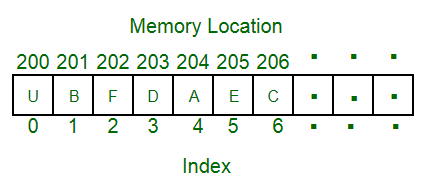
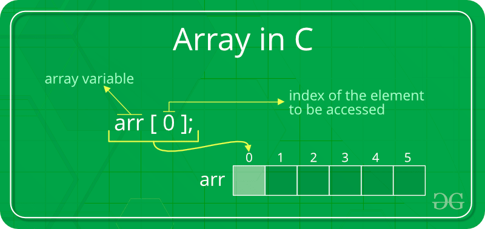

## Arrays

An array is a collection of items stored at contiguous memory locations.

> The idea is to store multiple items of the same type together.
> This makes it easier to calculate the position of each element by simply adding an offset to a base value, i.e., the memory location of the first element of the array (generally denoted by the name of the array).




### Advantages of using arrays:

- Arrays allow random access to elements. This makes accessing elements by position faster.
- Arrays have better cache locality that makes a pretty big difference in performance.
- Arrays represent multiple data items of the same type using a single name.

### Disadvantages of using arrays:

- You can’t change the size i.e. once you have declared the array you can’t change its size because of static memory
  allocation.
- Here Insertion(s) and deletion(s) are difficult as the elements are stored in consecutive memory locations and the
  shifting operation is costly too.

### Applications on Array

- Array stores data elements of the same data type few languages like ruby, python can store different type of daata in
  array.
- Arrays can be used for CPU scheduling.
- Used to Implement other data structures like Stacks, Queues, Heaps, Hash tables, etc.

### Looping through Array
```java
int[] a = {1,2,3,4,0,98}

for(int i=0; i<a.length;i++){
    System.out.println(a[i])
}
```