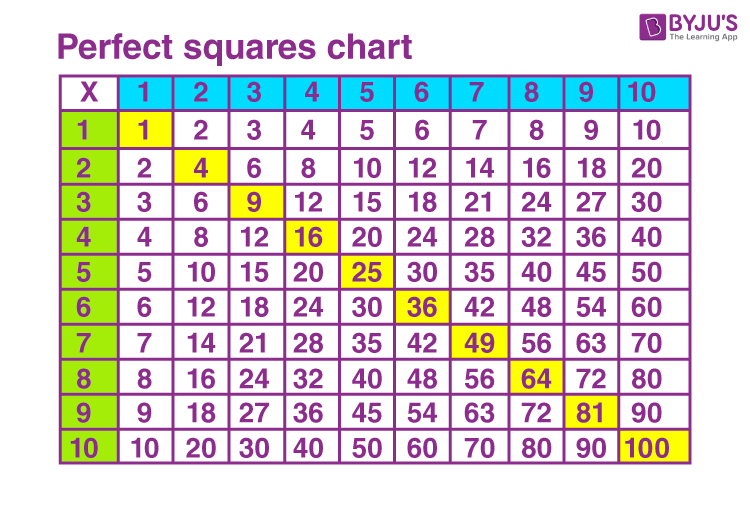
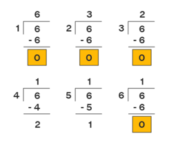
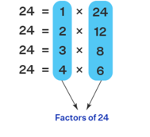
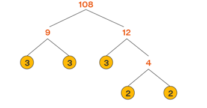
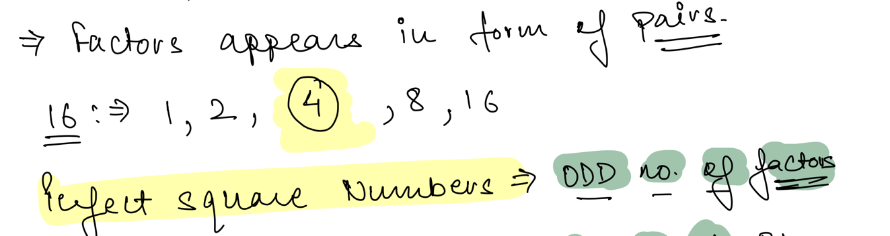

## Arrays & Maths

Fundamentally, software engineering involves solving problems by writing code and designing software systems. Similarly,
math, particularly proof-based math, involves solving problems by writing a series of correct statements in mathematical
language.

Few Points to Note:

> One must know how to solve Arithmetic and Binary Problems
>
> Probability & Stat.
>
> Linear Algebra
>
> Logical consistency and correctness are of the utmost importance

### Prime Numbers

A prime number is a natural number greater than 1, which is only divisible by 1 and itself. First few prime numbers
are : 2 3 5 7 11 13 17 19 23 …..

Some interesting fact about Prime numbers

- Two is the only even Prime number.
- Every prime number can be represented in form of 6n+1 or 6n-1 except the prime number 2 and 3, where n is a natural
  number.
- Two and Three are only two consecutive natural numbers that are prime.

### Perfect Square

An integer that can be expressed as the square of another integer is called a perfect square. In other words, it is
defined as the product of some integer with itself.

## Factor of a Number

Factor, in mathematics is a number or algebraic expression that divides another number or expression evenly—i.e., with
no remainder.

**Properties of a Factor**

1. The number of factors of a number is finite.
2. A factor of a number is always less than or equal to the given number.
3. Every number except 0 and 1 has at least two factors, 1 and itself.
4. Division and multiplication are the operations that are used in finding the factors.

**How to Find Factors of a Number?**

- We can use both "Division" to find the factors.
  
- We can use both "Multiplication" to find the factors of a given number.
  
- Prime factorizaation
  
  In the exponent form: 108 = 22 × 33. Add 1 to each of the exponents, 2 and 3, here. Then, 2 + 1 = 3, 3 + 1 = 4.
  Multiply these numbers: 3 × 4 = 12. Thus, Number of factors of 108 is 12. The actual factors of 108 are 1, 2, 3, 4, 6,
  9, 12, 18, 27, 36, 54, and 108. Here, 108 has 12 factors and hence our above answer is correct.

> Note: `Factors Appear in form of Pairs. Even no of Factors cannot be a Perfect Square.`
> 

## Problems

> Problem
>
> There are 100 doors, all closed. In a nearby cage are 100 monkeys. The first monkey is let out and runs along the doors opening every one. The second monkey is then let out and runs along the doors closing the 2nd, 4th, 6th,… - all the even-numbered doors. The third monkey is let out. He attends only to the 3rd, 6th, 9th,… doors (every third door, in other words), closing any that is open and opening any that is closed, and so on. After all 100 monkeys have done their work in this way, what state are the doors in after the last pass?
>
> Solution:
>
> All Numbers with Perfect Square would be Open.
> N = 10 {1,4,9,16,25,36,49,64,81,100}