## Arrays - Prefix Sum

Prefix array is a very vital tool in competitive programming. This helps to minimize the repeated calculation done in an
array and thus reduces the time complexity of your program.

To fill the prefix sum array, we run through index 1 to last and keep on adding the present element with the previous
value in the prefix sum array.

| input numbers   |1|2| 3| 4| 5| 6 |...| 
|-----------------|-------| -------| -------|-------|-------|-------| -------| 
| **prefix sums** | 1 |3 |6 |10 | 15| 21 | ... |

```text
ps[0]=a[0]
ps[1]=a[0]+a[1]
ps[2]=a[0]+a[1]+a[2]
```

**OR**

```text
ps[0]=a[0]
ps[1]=ps[0]+a[1]
ps[2]=ps[1]+a[2]

ps[i] = ps[i-1] + a[i]
```

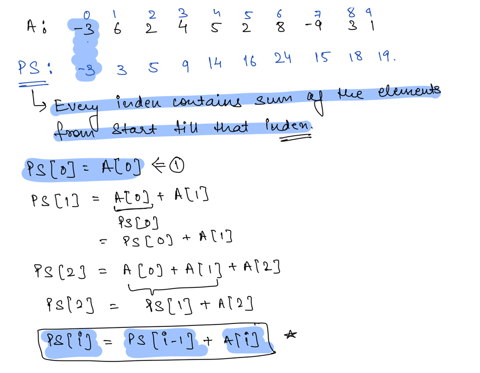

- **Whenever you encounter a problem with range sum use Prefix Sum approach to solve the problem.**

### Properties

If the given array A has all non-negative numbers the the prefix array constructed will be sorted in non-descending
order.

### Build Prefix Sum

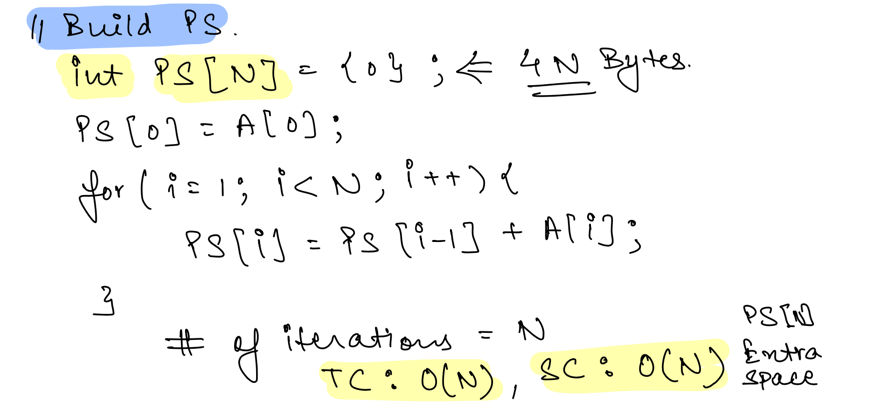

### Problems

- Given an Array return true if there is an Equillibrium Index in the Array
    - Equillibrium Index is the index for which sum of elements on left side = sum of elements on right side
    - A: [0, 1, 2, 3, 4, **8**, 10]
        - 8 is the Equillibrium Index as Sum<sub>Left</sub>(10) = Sum<sub>Right</sub>(10)
    - Brute Force:
      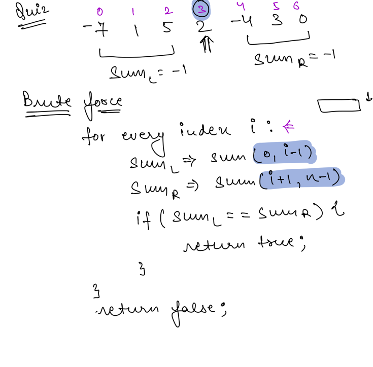
    - Optimized Approach using Prefix Sum
      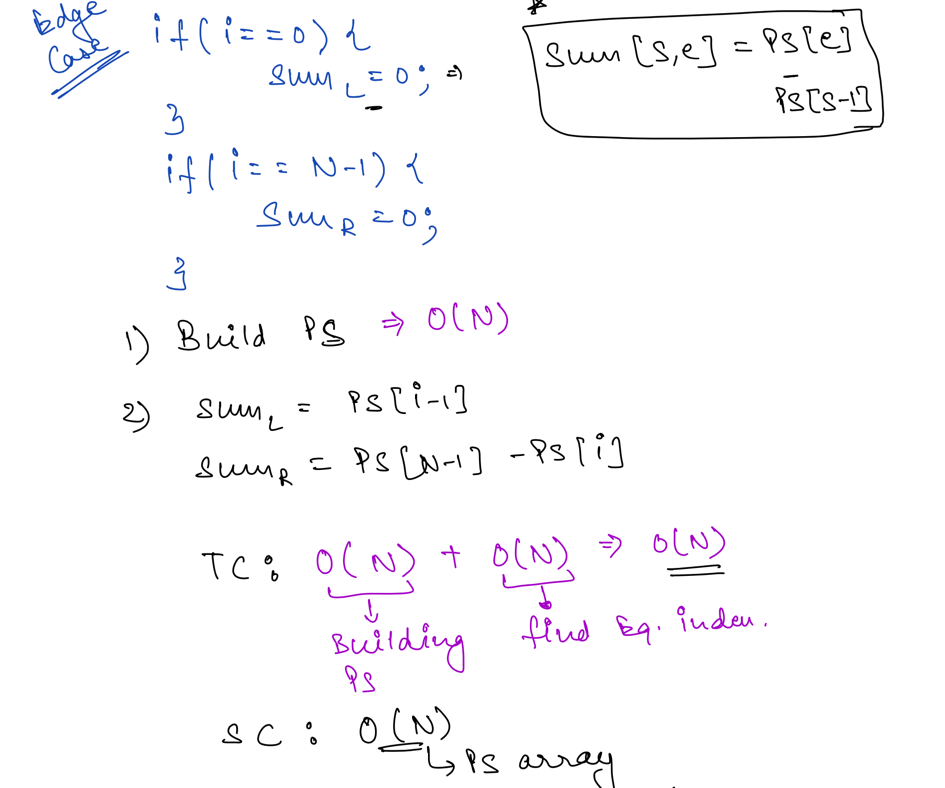

```java
// Java Solution
public class Solution {
    public int solve(int[] A) {
        long sum1 = 0;
        for (int i = 0; i < A.length; i++) sum1 += A[i];
        long sum2 = 0;
        int ans = Integer.MAX_VALUE;
        for (int i = 0; i < A.length; i++) {
            sum1 -= A[i];
            if (sum1 == sum2) {
                ans = i;
                break;
            }
            sum2 += A[i];
        }
        if (ans == Integer.MAX_VALUE) ans = -1;
        return ans;
    }
}
```

```python
# Python
  class Solution:
    # @param A : list of integers
    # @return an integer
    def solve(self, A):
        n = len(A)
        summ = 0
        for i in A:
            summ += i
        l = 0
        for i in range(0, n):
            summ -= A[i]
            if l == summ :
                return i
            l += A[i]
        return -1;
```

- Count ways to make sum of odd and even indexed elements equal by removing an array element
    - Given an array, arr[] of size N, the task is to find the count of array indices such that removing an element from
      these indices makes the sum of even-indexed and odd-indexed array elements equal.
        - Approach:
            - Initialize two variables, say evenSum and oddSum, to store the sum of odd-indexed and even-indexed
              elements of the given array respectively.
            - Traverse the array using variable i.
            - Remove every ith element of the array and update the sum of the remaining even-indexed elements and the
              odd-indexed elements based on the above observation. Check if the sums are equal or not.
            - If found to be true, then increment the count.
            - Finally, print the count obtained.
        - Solution

```java
  public class Solution {

    private int cntIndexesToMakeBalance(int arr[], int n) {
        if (n == 1) {
            return 1;
        }

        if (n == 2)
            return 0;

        int sumEven = 0;
        int sumOdd = 0;

        for (int i = 0; i < n; i++) {
            if (i % 2 == 0) {
                sumEven += arr[i];
            } else {
                sumOdd += arr[i];
            }
        }

        int currOdd = 0;
        int currEven = arr[0];
        int res = 0;
        int newEvenSum = 0;
        int newOddSum = 0;

        for (int i = 1; i < n - 1; i++) {
            if (i % 2 == 1) {
                currOdd += arr[i];
                newEvenSum = currEven + sumOdd
                        - currOdd;
                newOddSum = currOdd + sumEven
                        - currEven - arr[i];
            } else {
                currEven += arr[i];
                newOddSum = currOdd + sumEven
                        - currEven;
                newEvenSum = currEven + sumOdd
                        - currOdd - arr[i];
            }
            if (newEvenSum == newOddSum) {
                res++;
            }
        }
        if (sumOdd == sumEven - arr[0]) {
            res++;
        }
        if (n % 2 == 1) {
            if (sumOdd == sumEven - arr[n - 1]) {
                res++;
            }
        } else {
            if (sumEven == sumOdd - arr[n - 1]) {
                res++;
            }
        }
        return res;
    }

    public int solve(int[] A) {
        int n = A.length;
        return cntIndexesToMakeBalance(A, n);
    }
}
```

```python
# Python Solution
class Solution:
    # @param A : list of integers
    # @return an integer
    def solve(self, A):
        n=len(A);
        if n==1:
            return 1
        if n==2:
            return 0
        sumEven = 0
        sumOdd = 0
        for i in range(n) :
            if (i % 2 == 0) :
                sumEven += A[i];
 
            else :
                sumOdd += A[i];
        currOdd = 0
        currEven = A[0]
        res = 0
        newEvenSum = 0
        newOddSum = 0
        for i in range(1,n-1):
            if i%2 :
                currOdd += A[i]
                newEvenSum = currEven + sumOdd- currOdd
                newOddSum = currOdd + sumEven - currEven - A[i]
            else :
                currEven += A[i]
                newOddSum = currOdd + sumEven  - currEven
                newEvenSum = currEven + sumOdd - currOdd -A[i]
            if (newEvenSum == newOddSum) :
                res+=1
        if (sumOdd == sumEven - A[0]) :
            res+=1
        if (n % 2 == 1) :
            if (sumOdd == sumEven - A[n - 1]) :
                res+=1
        else :
            if (sumEven == sumOdd - A[n - 1]) :
                res+=1
        return res
```

### Creating Prefix Sum even and Odd Arrays

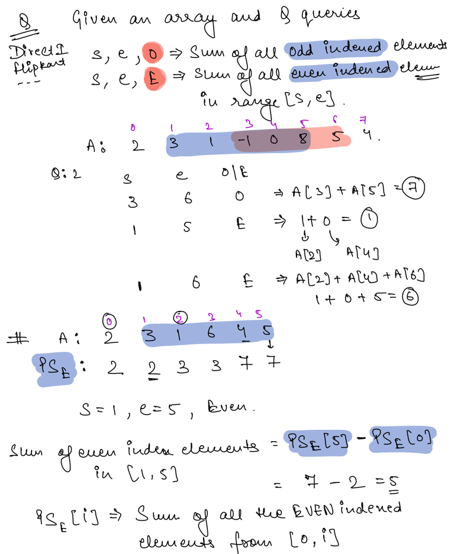
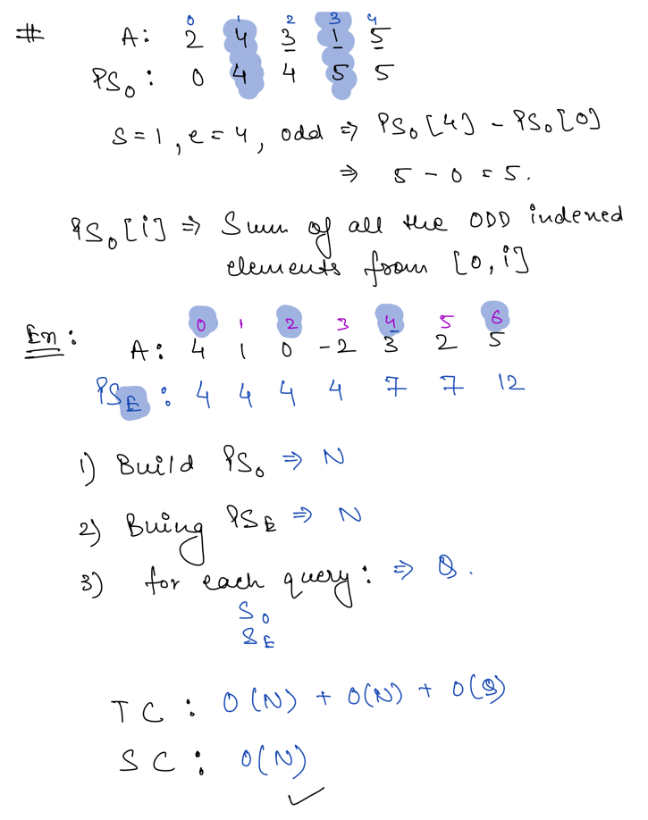

- If you are removing a element from array and calulating the sum(even) & sum(odd) use this formulae:
  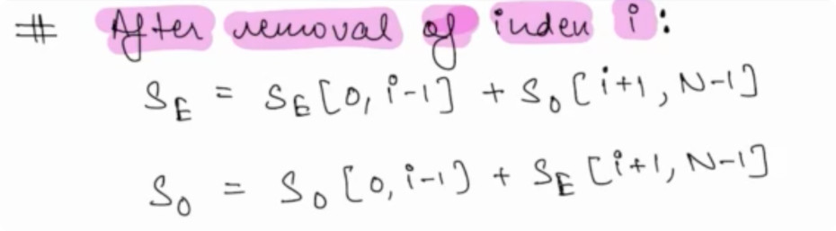
    - Example:
      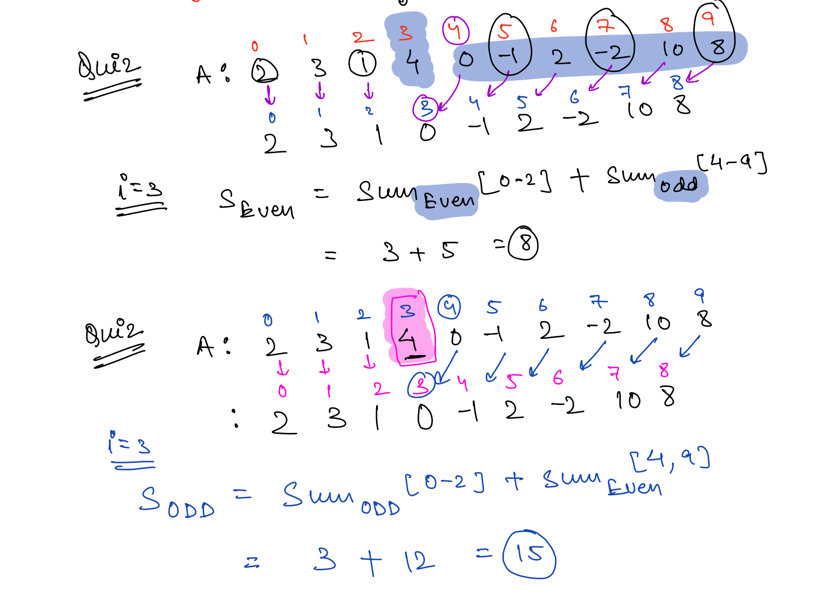
- Given an array count the number of special indexes in the array.
    - Special Index: An Index in the array after removing which Sum<Odd> Indexed Numbers = Sum<Even> Indexed Numbers
      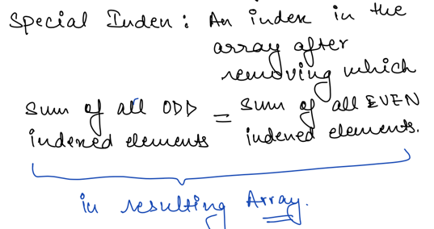
      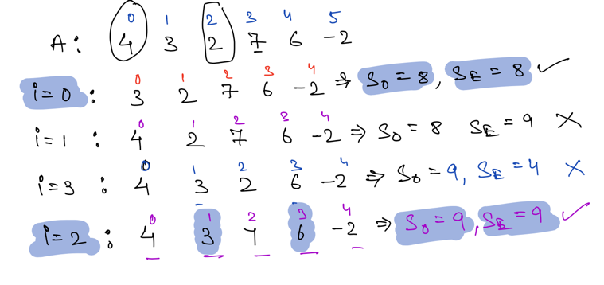
    - Solution
      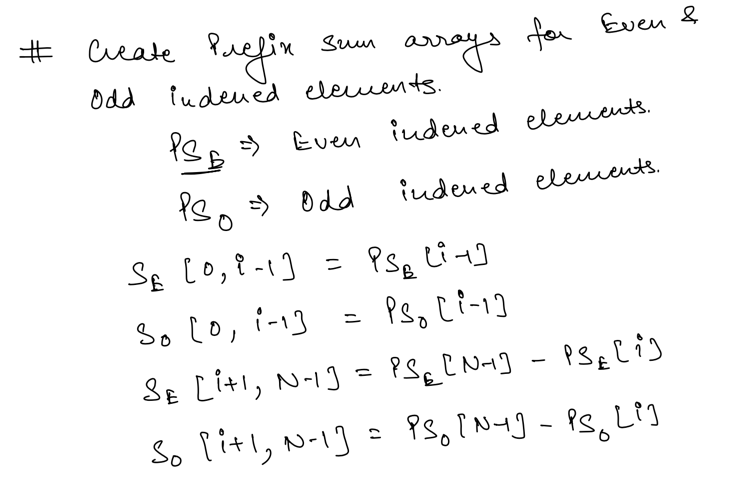
      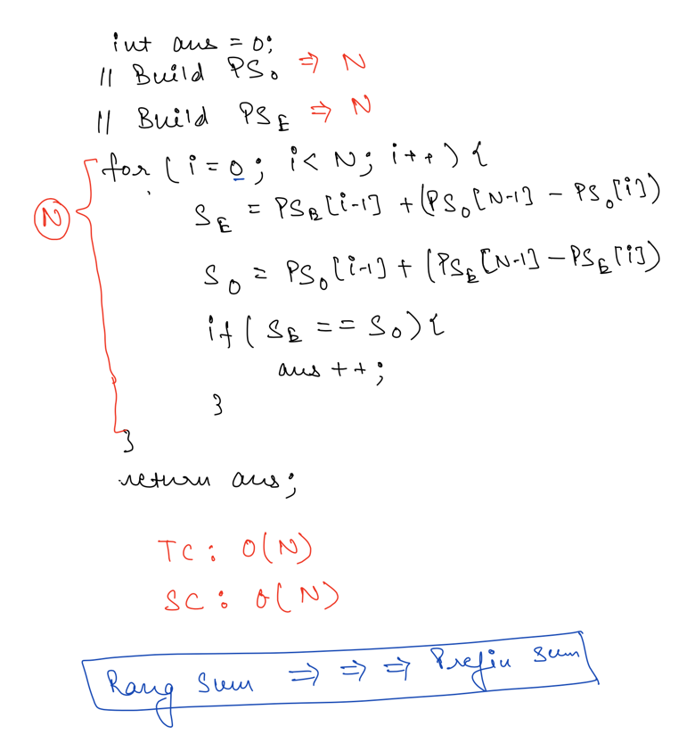

### Applications

- **Equilibrium index of an array:** The equilibrium index of an array is an index such that the sum of elements at
  lower indexes is equal to the sum of elements at higher indexes.
    - [equilibrium-index-of-an-array](https://www.geeksforgeeks.org/equilibrium-index-of-an-array/)
- **Find if there is a subarray with 0 sum:** Given an array of positive and negative numbers, find if there is a
  subarray (of size at least one) with 0 sum.
    - [find-if-there-is-a-subarray-with-0-sum](https://www.geeksforgeeks.org/find-if-there-is-a-subarray-with-0-sum/)
- **Maximum subarray size, such that all subarrays of that size have sum less than k:** Given an array of n positive
  integers and a positive integer k, the task is to find the maximum subarray size such that all subarrays of that size
  have the sum of elements less than k.
    - [maximum-subarray-size-subarrays-size-sum-less-k](https://www.geeksforgeeks.org/maximum-subarray-size-subarrays-size-sum-less-k/)
- **Find the prime numbers which can written as sum of most consecutive primes:** Given an array of limits. For every
  limit, find the prime number which can be written as the sum of the most consecutive primes smaller than or equal to
  the limit.
    - [find-prime-number-can-written-sum-consecutive-primes](https://www.geeksforgeeks.org/find-prime-number-can-written-sum-consecutive-primes/)
- **Longest Span with same Sum in two Binary arrays:** Given two binary arrays, arr1[] and arr2[] of the same size n.
  Find the length of the longest common span (i, j) where j >= i such that arr1[i] + arr1[i+1] + … + arr1[j] = arr2[i] +
  arr2[i+1] + … + arr2[j].
    - [longest-span-sum-two-binary-arrays](https://www.geeksforgeeks.org/longest-span-sum-two-binary-arrays/)
- **Maximum subarray sum modulo m:** Given an array of n elements and an integer m. The task is to find the maximum
  value of the sum of its subarray modulo m i.e find the sum of each subarray mod m and print the maximum value of this
  modulo operation.
    - [maximum-subarray-sum-modulo-m](https://www.geeksforgeeks.org/maximum-subarray-sum-modulo-m/)
- **Maximum subarray size, such that all subarrays of that size have sum less than k:** Given an array of n positive
  integers and a positive integer k, the task is to find the maximum subarray size such that all subarrays of that size
  have sum of elements less than k.
    - [maximum-subarray-size-subarrays-size-sum-less-k](https://www.geeksforgeeks.org/maximum-subarray-size-subarrays-size-sum-less-k/)
- **Maximum occurred integer in n ranges :** Given n ranges of the form L and R, the task is to find the maximum
  occurring integer in all the ranges. If more than one such integer exits, print the smallest one.
    - [maximum-occurred-integer-n-ranges](https://www.geeksforgeeks.org/maximum-occurred-integer-n-ranges/)
- **Minimum cost for acquiring all coins with k extra coins allowed with every coin:** You are given a list of N coins
  of different denominations. you can pay an amount equivalent to any 1 coin and can acquire that coin. In addition,
  once you have paid for a coin, we can choose at most K more coins and can acquire those for free. The task is to find
  the minimum amount required to acquire all the N coins for a given value of K.
    - [minimum-cost-for-acquiring-all-coins-with-k-extra-coins-allowed-with-every-coin](https://www.geeksforgeeks.org/minimum-cost-for-acquiring-all-coins-with-k-extra-coins-allowed-with-every-coin/)
- **Random number generator in arbitrary probability distribution fashion:** Given n numbers, each with some frequency
  of occurrence. Return a random number with a probability proportional to its frequency of occurrence.
    - [random-number-generator-in-arbitrary-probability-distribution-fashion](https://www.geeksforgeeks.org/random-number-generator-in-arbitrary-probability-distribution-fashion/)