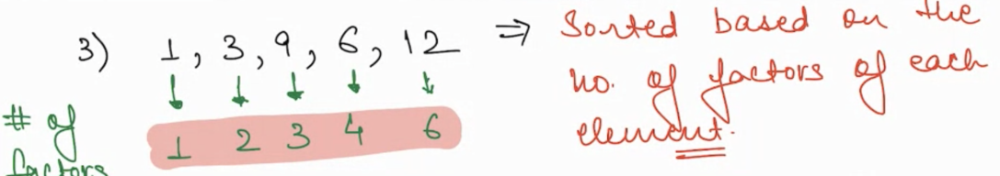

## Sorting

Sorting is any process of arranging items systematically

In Computer world a Sorting Algorithm is used to rearrange a given array or list elements according to a comparison
operator on the elements.

- Sorting makes searching`(one of most frequent operation)` optimised

The comparison operator is used to decide the new order of element in the respective data structure.

**What is covered here ?**

- Why Sorting
- Problems on Sorting
- Comparator Function

> > Ascending Order Sort
>
> 3,7,8,9,11,14

> > Descending Order Sort
>
> 20,19,14,8,3

> > Sorted by no of factors
>
> 1,3,9,6,12
>
> 1 has 1 factor, 2 has 3 factors, 3 has 9 factors ...
> 

### How Sorting Happens?
All Sorting algo are comparison based , It compares two elements and swap based on use case.

### Notes

- TC: O(NLogN)
- SC: O(1)/O(N) Depends on sorting algorithm