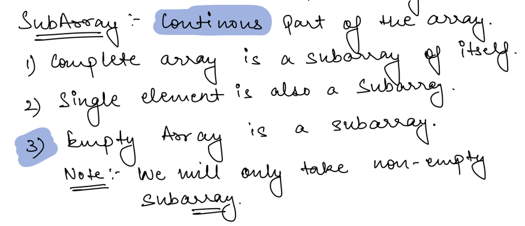
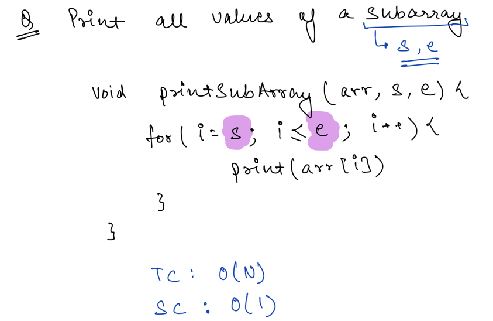
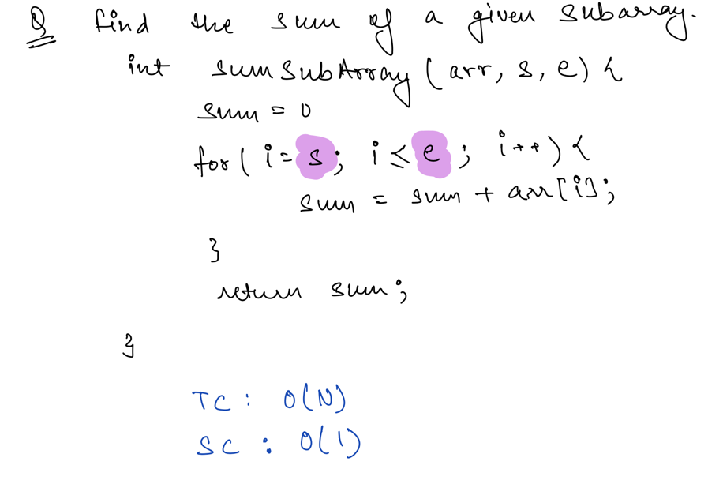
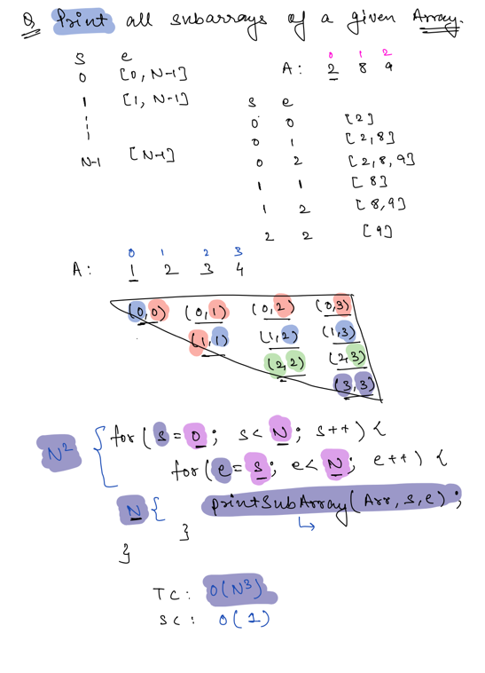
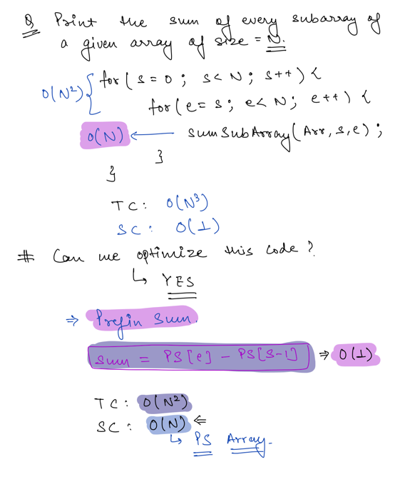
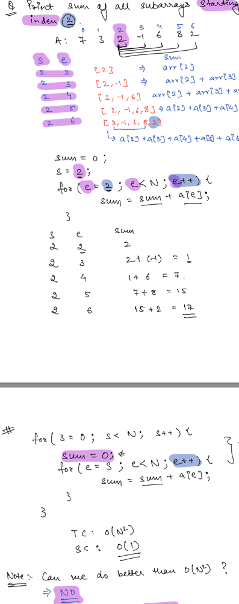

## Arrays - Subarrays

A _subarray_ is a slice from a _**contiguous**_ array (i.e., occupy consecutive positions) and inherently maintains the
order of elements.

Subarrays are arrays within another array.

- For example, the **subarrays** of array {1, 2, 3} are {1}, {1, 2}, {1, 2, 3}, {2}, {2, 3}, and {3}.

**_Note:_** No of Sub arrays for a Array of Size N - `(N*(N+1))/2`

### Problem 1 - Print all values of a sub array

### Problem 2 - Sum of a given sub array

### Problem 3 - Print all Sub arrays of a Given Array

### Problem 4 - Print Sum of Every Sub array

### Problem 5 - Print Sum of all Sub arrays starting with a given index

