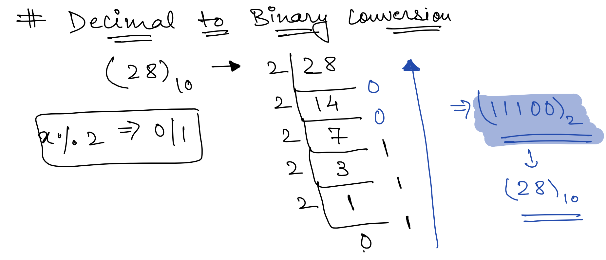
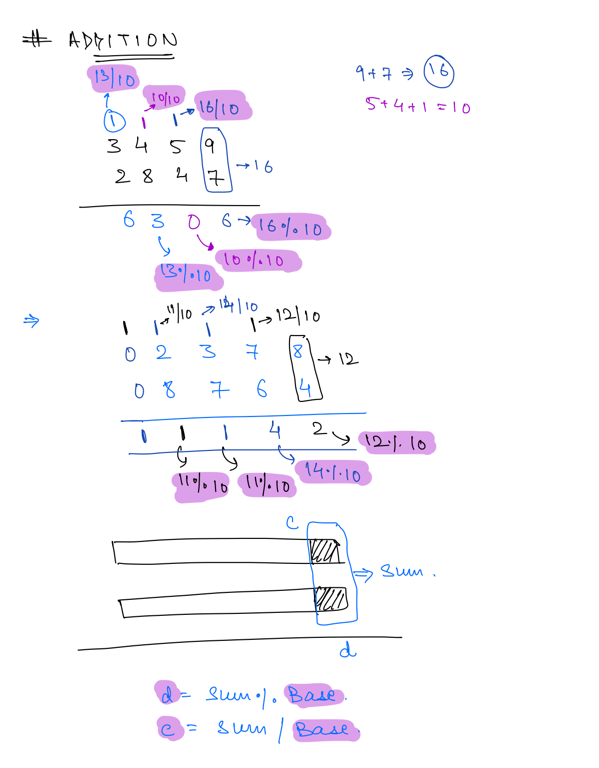
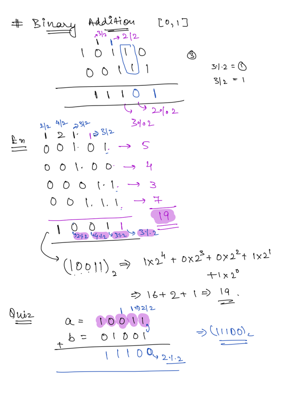
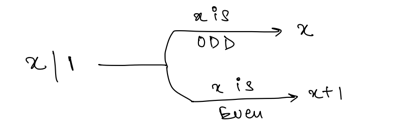
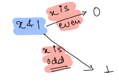
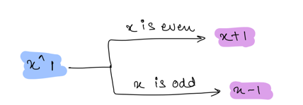
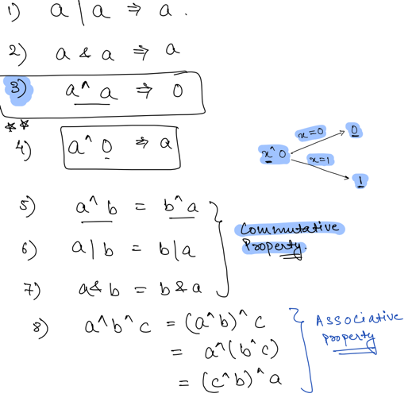

## Bit Manipulation

Operations Performed in Bit that improves execution time as it acts on bits directly.

### Bit Operators

- AND(&)
- OR(|)
- XOR(^)
- NOT(~)
- Left Shift (<<)
- Right Shift (>>)

### Number System

- Decimal Number System (Base - `10`) [0-9]
- Octal Number System (Base- `8`) [0-7]
- Hexa Decimal Number System (Base - `16`) [0-9, A-F]
- Ternary Number System Number System (Base - `3`) [0-2]
- Binary Number System (Base - `2`) [0,1]

### Decimal to Binary

---------------------------------------

### Decimal Addition

---------------------------------------

### Binary Addition

---------------------------------------

### Operations

| A   | B   | A & B | A I B | A ^ B |
|-----|-----|-------|-------|-------|
| 0   | 0   | 0     | 0     | 0     |
| 0   | 1   | 0     | 1     | 1     |
| 1   | 0   | 0     | 1     | 1     |
| 1   | 1   | 1     | 1     | 0     |

| A   | ~A  |
|-----|-----|
| 0   | 1   |
| 1   | 0   |

### Notes

---------------------------------------

---------------------------------------

---------------------------------------

---------------------------------------

#### XOR

- EvenNum ^ 1 = EvenNum + 1
- OddNum ^ 1 = OddNum - 1
- a ^ a = 0

#### AND

- EvenNum & 1 = 0
- OddNum & 1 = 1
- a & a = a

#### OR

- EvenNum | 1 = EvenNum + 1
- OddNum | 1 = OddNum
- a | a = a