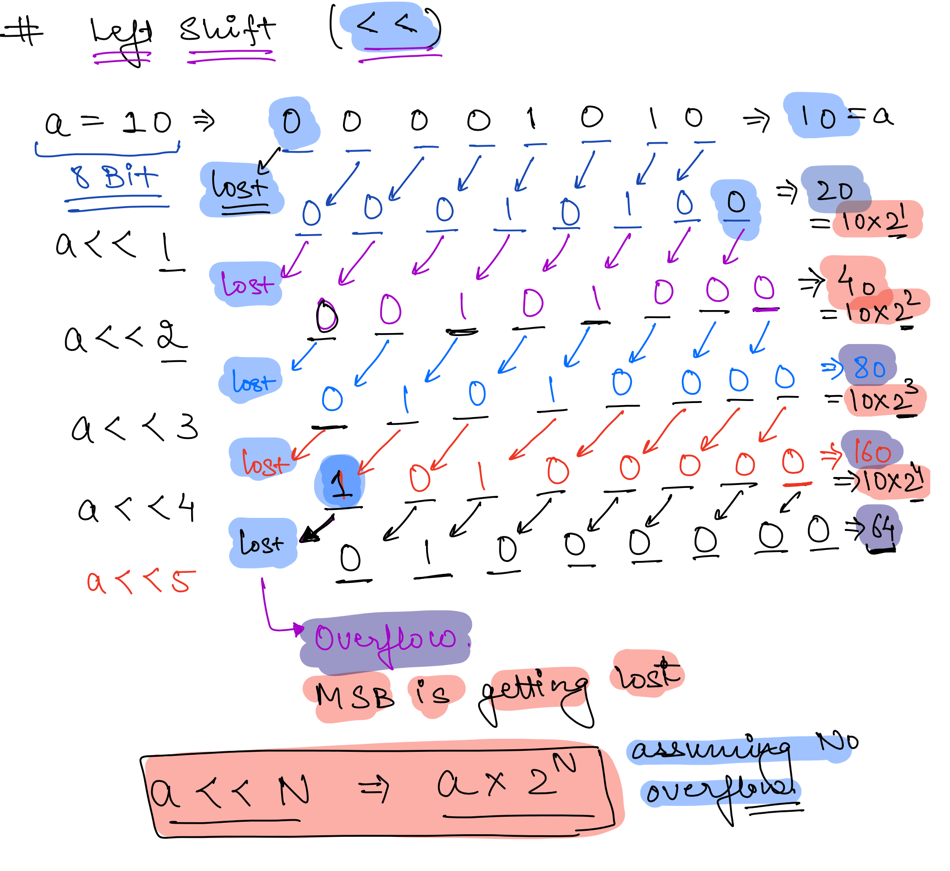
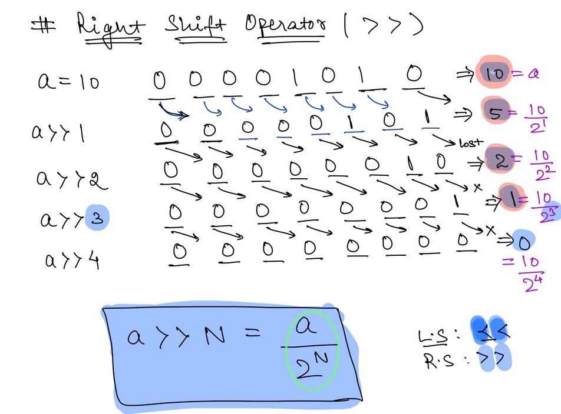

### Left Shift Operator

- Formulae: `a << N` = a * 2<sup>n</sup>
  - a `->` Input Number
  - N `->` How many times the number a should be shifted

```java
 1 << 3 = 1 * 2^3
 2 << 3 = 2 * 2^3
 2 << 2 = 2 * 2^2       
 3 << 3 = 3 * 2^3
```



### Right Shift Operator

- Formulae: `a >> N` = a / 2<sup>n</sup>
    - a `->` Input Number
    - N `->` How many times the number a should be shifted

```java
 1 >> 3 = 1 / 2^3
 2 >> 3 = 2 / 2^3
 2 >> 2 = 2 / 2^2       
 3 >> 3 = 3 / 2^3
```


### Tips & Tricks

- N & (N-1) Unsets the right most set bit.
```ruby
  def check_bit_right_shift(num, bit_no)
    return (num >> bit_no) & 1 == 1 ? true : false
  end
  
  def check_bit_left_shift(num, bit_no)
    return (num & (1<<bit_no)) != 0 ? true : false
  end

  def set_bit(num, bit_no)
    return num | (1 << bit_no)
  end

  # 0^1 = 1
  # 1^0 = 0
  def toggle_bit(num, bit_no)
    return num ^ (1 << bit_no)
  end
```
