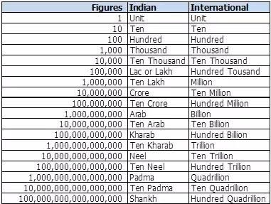
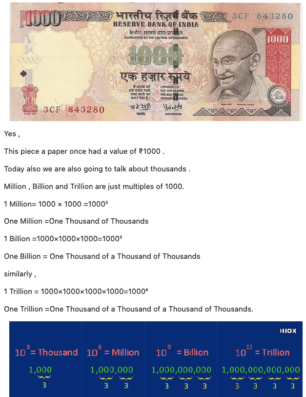

# Byte System

A computer processor is made up of multiple decisive circuits, each one of which may be either OFF or ON. These two
states
in terms of memory are represented by a 0 or 1. In order to count higher than 1, such bits (BInary digiTS) are suspended
together. A group of eight bits is known as a byte. 1 byte can represent numbers between zero (00000000) and 255 (
11111111), or 28 = 256 distinct positions.

These bytes may also be combined to represent larger numbers.
The computer represents all characters and numbers internally in the same fashion.

## Tabular Representation of various Memory Sizes

| Name      | Equal To           | Size(In Bytes)                            | Approximation in Power |
|-----------|--------------------|-------------------------------------------|------------------------|
| Bit       | 	1 Bit             | 1/8                                       | -                      | 
| Nibble    | 	4 Bits            | 1/2 (rare)                                | -                      |
| Byte      | 	8 Bits            | 1                                         | 10^0                   |
| Kilobyte  | 	1024 Bytes        | 1024 / **(2^10)**                         | 10^3                   |
| Megabyte  | 	1, 024 Kilobytes  | 1, 048, 576                               | 10^6                   |
| Gigabyte  | 	1, 024 Megabytes  | 1, 073, 741, 824                          | 10^9                   |
| Terrabyte | 	1, 024 Gigabytes  | 1, 099, 511, 627, 776                     | 10^12                  |
| Petabyte  | 	1, 024 Terabytes  | 1, 125, 899, 906, 842, 624                | 10^15                  |
| Exabyte   | 	1, 024 Petabytes  | 1, 152, 921, 504, 606, 846, 976           | 10^18                  |
| Zettabyte | 	1, 024 Exabytes	  | 1, 180, 591, 620, 717, 411, 303, 424      | 10^21                  |
| Yottabyte | 	1, 024 Zettabytes | 1, 208, 925, 819, 614, 629, 174, 706, 176 | 10^24                  |

## Currency System

* 1 Thousand = 10^3
* 1 Million = 10^6
* 1 Billion = 10^9
* 1 Arab = 10^10
* 1 Kharab = 10^11
* 1 Trillion = 10 ^12

**You Must be Knowing this :**
