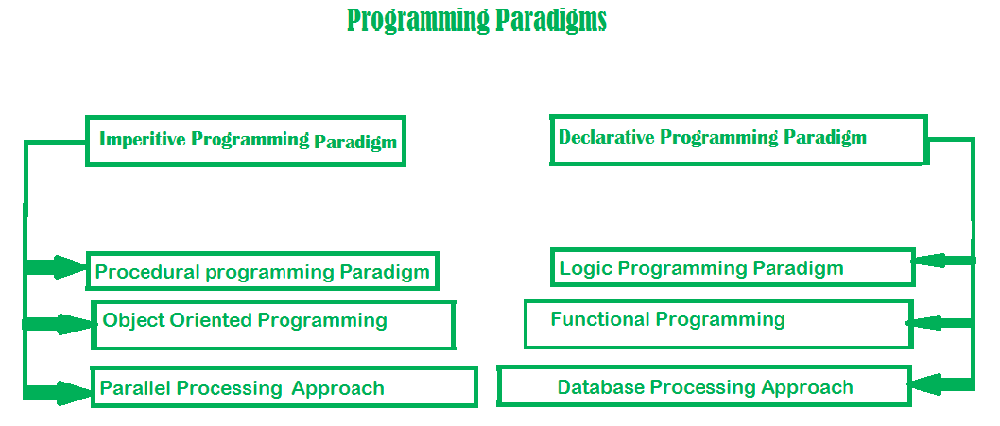

# Terminologies

## Computer Registers

- Registers are a type of computer memory used to quickly accept, store, and transfer data and instructions that are being used immediately by the CPU. The registers used by the CPU are often termed as Processor registers.

- Computer registers are high-speed memory storing units. It is an element of the computer processor.

## High-level programming language

In computer science, a high-level programming language is a programming language with strong abstraction from the details of the computer.

## Low-level programming language

A low-level programming language is a programming language that provides little or no abstraction from a computer's instruction set architecture—commands or functions in the language map that are structurally similar to processor's instructions. Generally, this refers to either machine code or assembly language.

```
8B542408 83FA0077 06B80000 0000C383
FA027706 B8010000 00C353BB 01000000
B9010000 008D0419 83FA0376 078BD989
C14AEBF1 5BC3
```

## Programming Paradigm

Paradigm can also be termed as method to solve some problem or do some task. Programming paradigm is an approach to solve problem using some programming language or also we can say it is a method to solve a problem using tools and techniques that are available to us following some approach.



## Mutable & Immutable

Mutable is a fancy way of saying that the internal state of the object is changed/mutated. So, the simplest definition is: An object whose internal state can be changed is mutable. On the other hand, immutable doesn't allow any change in the object once it has been created.


