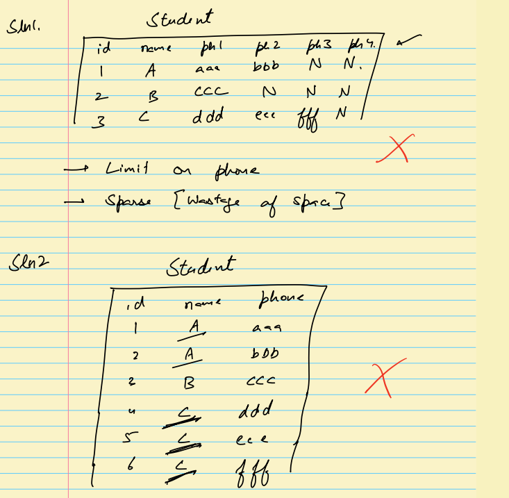
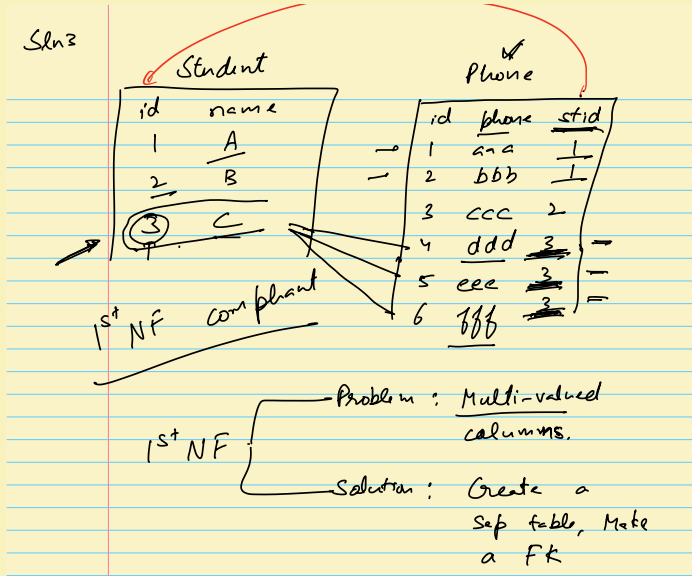
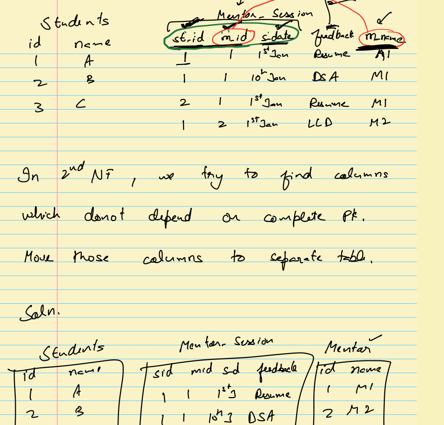
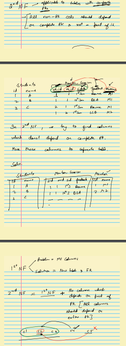
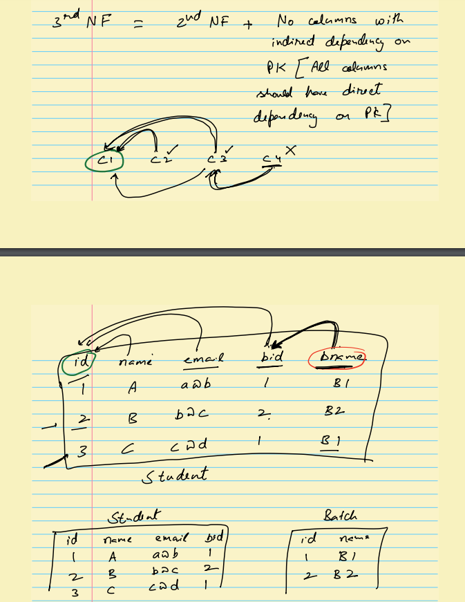
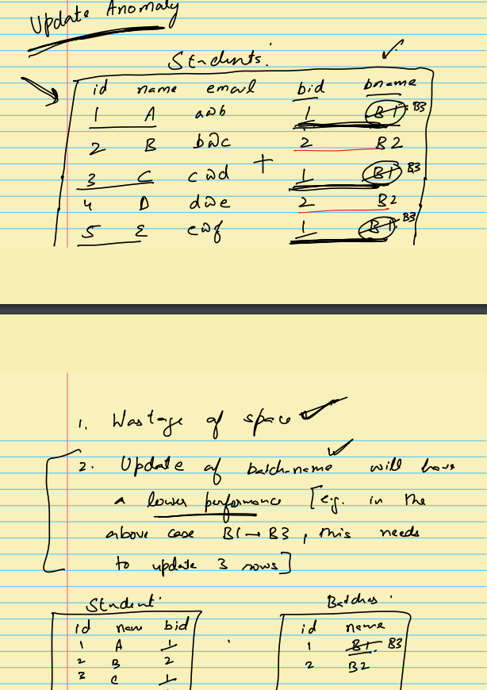
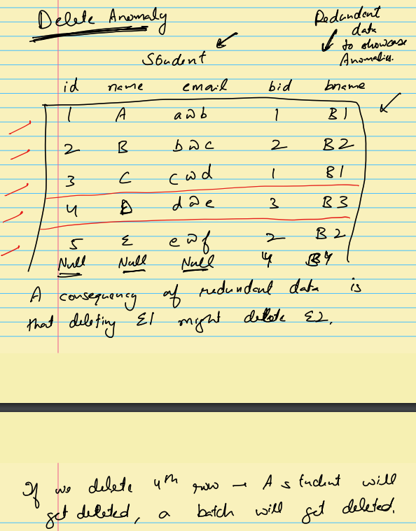

# Data Normalization

DB Normalization is a technique that detects degree of redundancy(needless) of data in a database.

## Normal Forms

- 1NF (First Normal Form)
  - Each table cell should contain a single value.
  - Each record needs to be unique.
  - DB should not have multivalued columns
    
    
- 2NF (Second Normal Form)
  - Rule 1- Be in 1NF
  - Rule 2- Single Column Primary Key that does not functionally dependant on any subset of candidate key relation
  - 
  - 
  - In the above Image the pk for mentor_sessions table is st_id, m_id and s_date and feedback col depends on all pk and m_name only depends on m_id hence its not complying with 2nf.
- 3NF (Third Normal Form)
  - Rule 1- Be in 2NF
  - Rule 2- Has no transitive functional dependencies
  - 
  - Can I find the value of col using Primary Key ? Ask this Question
  - Can I find the value of a col without using Primary Key ? Ask this Question
- 3.5NF - BCNF (Boyce-Codd Normal Form)
- 4NF (Fourth Normal Form)
- 5NF (Fifth Normal Form)
- 6NF (Sixth Normal Form)

## Anomalies

- Update Anomaly
  
  - Data Inconsistency increases if we have duplicate data - A user can enter data with typo.
- Insert Anomaly
  - We cannot insert a record with 0 dependency.
  - E.g If we have Student and Batch in Single table we cannot insert a Batch record with 0 Students
- Delete Anomaly
  
