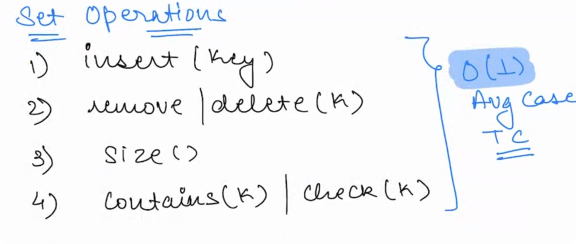

## Hashing Introduction

Hashing is the process of converting a given key into another value. A hash function is used to generate the new value
according to a mathematical algorithm. The result of a hash function is known as a hash value or simply, a hash.

In other words...

Hashing is the process of converting a given key into another smaller value for O(1) retrieval time.

Hashing is a Concept , `Hash Map` is one of the Implementation of Hashing.

A good hash function uses a one-way hashing algorithm, or in other words, the hash cannot be converted back into the
original key.

## HashMap

- HashMap class implements the Map interface which allows us to store key and value pair, where keys should be unique.
- If you try to insert the duplicate key, it will replace the element of the corresponding key. It is easy to perform
  operations using the key index like updation, deletion, etc.
- Points to remember
    - HashMap contains values based on the key.
    - HashMap contains only unique keys.
    - HashMap may have one null key and multiple null values.
    - HashMap is non synchronized.
    - HashMap maintains no order.
    - The initial default capacity of Java HashMap class is 16 with a load factor of 0.75.

Map in different Languages

| No. | Language | Map Type                              | Hash Set      |
|-----|----------|---------------------------------------|---------------|
| 1   | Java     | HashMap<Key Datatype, Value DataType> | HashSet       |
| 2   | Python   | Dictionary                            | Set           |
| 3   | C++      | Unordered List                        | Unordered set |
| 4   | Ruby     | Hash                                  | Set           |

## HashMap Operations

All the above Operation is done in Avg Case TC- O(1).

## HashSet

- It Stores only the Uniq Keys
- In Ruby we call this as [Set](https://www.rubyguides.com/2018/08/ruby-set-class/)
  

## Superset & Subset

- A superset is a set that contains all the elements of another set.
- You can check if one set is a superset of another
  - Set.new(10..40) >= Set.new(20..30)
    - The range 10..40 contains 20..30 within

- A subset is a set that is made from parts of another set
  - Set.new(25..27) <= Set.new(20..30)

## References

- https://www.interviewbit.com/tutorial/introduction-to-hashing/