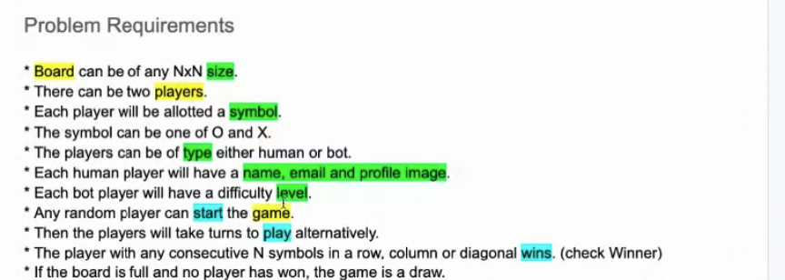

## How to approach Design Problems

Think ---> **Document**  --->  Discuss

### Development Life Cycle

1. Requirement Gathering
   - Product Manager Gathers this from Business Unit
   - Shared with Technical Team
2. Technical Design Document
   - Important Part of Design is Creating UML Diagrams
3. Implementation
   - Code
   - Test
   - Deploy
   - Maintain

> While gathering requirements ask question that are required to design the product, avoid asking questions that are features

> Think is the you dont ask question will the basic product be not built?

---

### Steps

- Identify the Entities
  - Identify the noun in Requirements
- Identify the Attributes/Functionality
  - Identify the Verbs

---

1. One Liner(Problem Statement)
2. Ask Questions
   - Current Scope
   - Future Scope
   - Behavior
     E.g : *Tic Tac Toe Questions*
   - https://docs.google.com/document/d/1xkdjWaPWqP-3S4pqm87IoPgtJTRp26Aa2soKORGz0zQ/edit
   - 
3. Look for:
   - Entities
     - Attributes
   - Verb
     - Behaviour
       
4. Tech Design
   1. Use Case Diagram
      1. https://www.planttext.com/