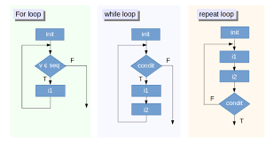

## Loop
A loop is a sequence of instruction(s) that is continually repeated until a certain condition is reached.

An infinite loop is one that lacks a functioning exit routine. 

The result is that the loop repeats continually until the operating system senses it and terminates the program with an error or until some other event occurs.
 

#### Types of Loops
- **_Entry Controlled Loop_** 
    - In an entry controlled Loop, the control statement is written right at the beginning of the Loop.
    - This type of Loop is also called a pre-checking Loop. The conditions in the control statements are checked at first, and only if the conditions are true, the body of the Loop is executed.
    - If the condition turns out to be false, the lines of code in the body of the Loop will not be executed.
 
- **_Exit Controlled Loop_**
    - In an exit controlled Loop, The control statement is written at the end of the Loop structure. 
    - The lines of codes in the body of the Loop are executed once before the condition is checked. Hence, this type of Loop is also called a post-checking Loop.   

| # |Loop Type| Description |
| ------ | ---- | ---- |
| **1** |_While Loop_|In while loop, a condition is evaluated before processing a body of the loop. If a condition is true then and only then the body of a loop is executed.|
| **2** | _Do-While Loop_ |In a do…while loop, the condition is always executed after the body of a loop. It is also called an exit-controlled loop.
| **3** | _For...Loop_ |In a for loop, the initial value is performed only once, then the condition tests and compares the counter to a fixed value after each iteration, stopping the for loop when false is returned.|
