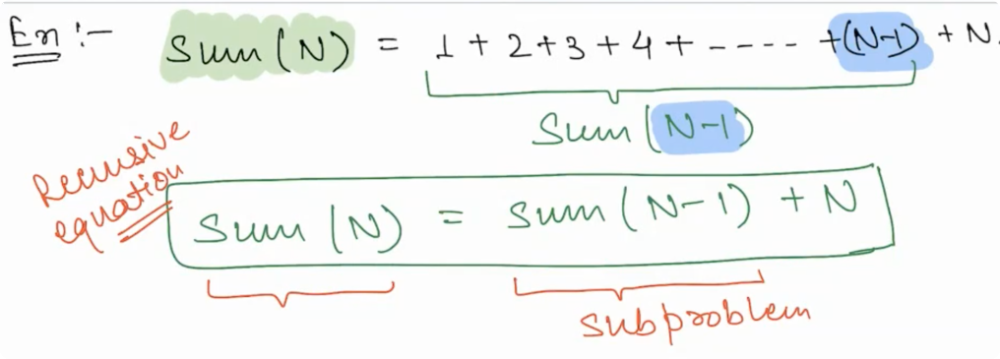
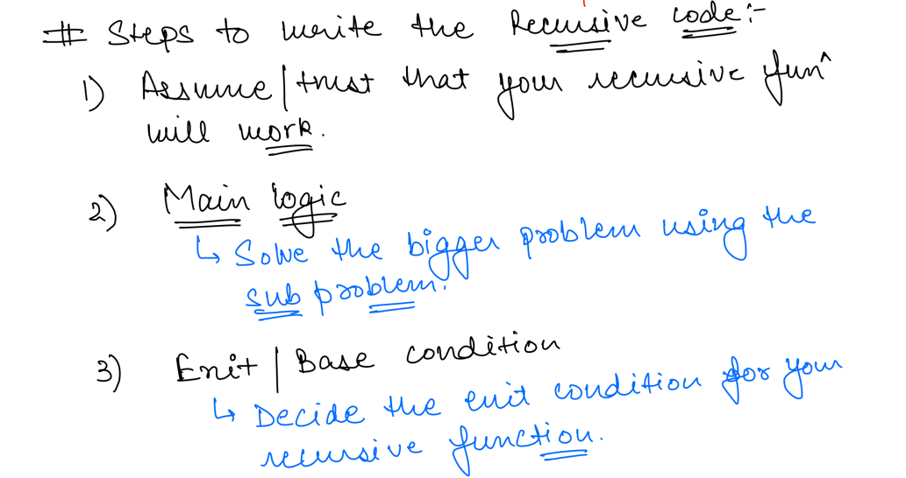
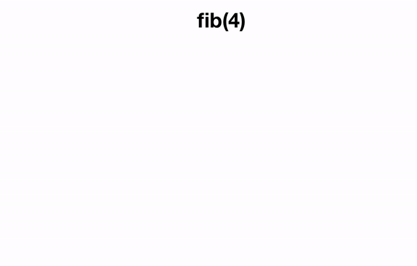
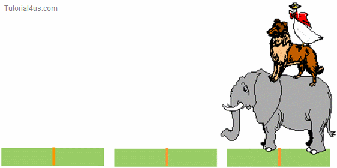

## Recursion

The process in which a function calls itself directly or indirectly is called recursion and the corresponding function
is called as recursive function.

```text
func(x){
    func(x-1);
}
```

###### In Other Words

Recursion is the process of repeating items in a self-similar way. In programming languages, if a program allows you to
call a function inside the same function, then it is called a recursive call of the function.

Recursion is a technique of solving a problem using smaller instances of same problem.

```text
Sum of N Natural Numbers 

Sum(N) = Sum(N-1) + N
```

*Sum of N Natural Number*

*Recursion Rule*


- **Fibonacci Series**
  

- **Tower of Hanoi**
  

### When to Loop? When to Recurse?

> A loop is used to perform a repetitive block of code as many times as necessary for the program.

_A big difference between recursion and iteration is the way that they end. While a loop executes the block of code,
checking each time to see if it is at the end of the sequence, there is no such sequential end for recursive code._

### When should I use recursion?

_Recursion is made for solving problems that can be broken down into smaller, repetitive problems. It is especially good
for working on things that have many possible branches and are too complex for an iterative approach._

### Data Structure that requires knowledge of recursion

- Merge Sort/Quick Sort
- Binary Tree/ BST
- Heaps/ Tries
- Segment Trees
- Dynamic Programming
- Backtracking