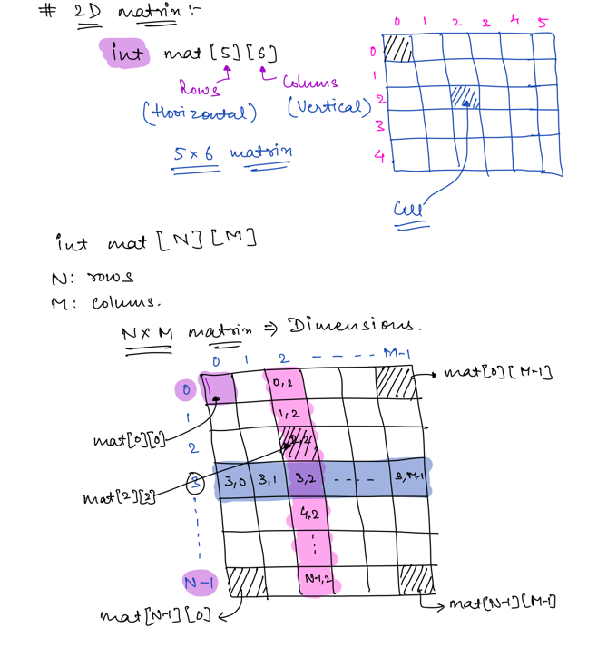
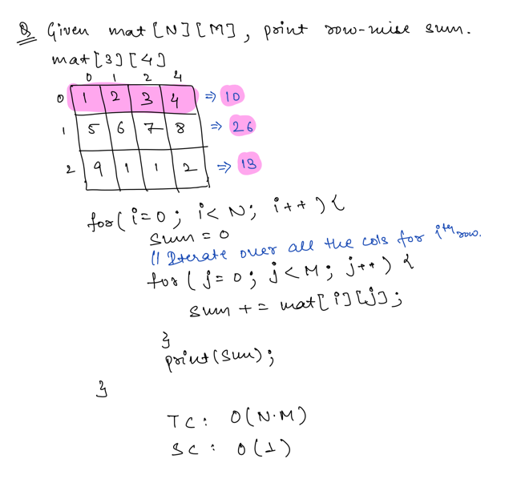
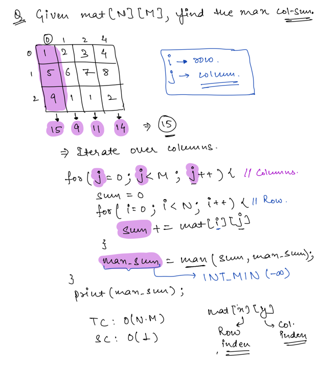
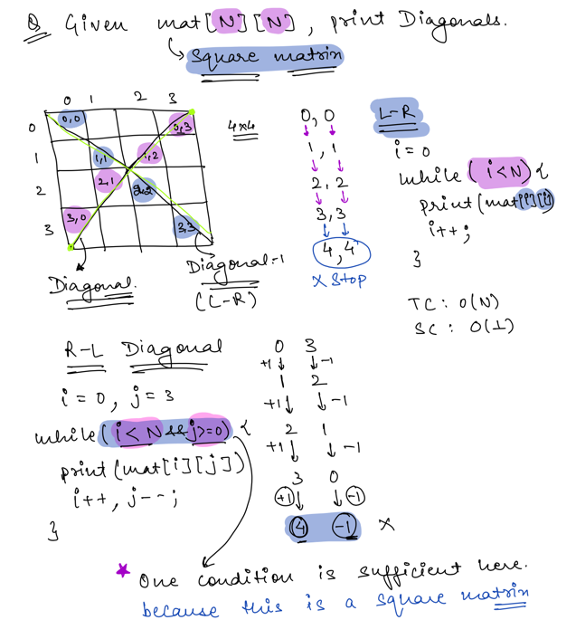
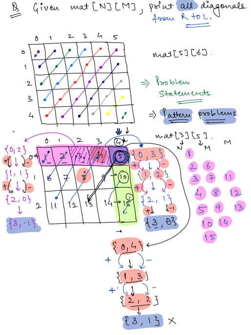
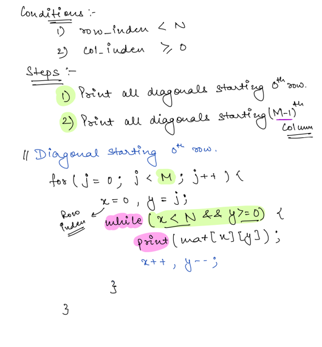
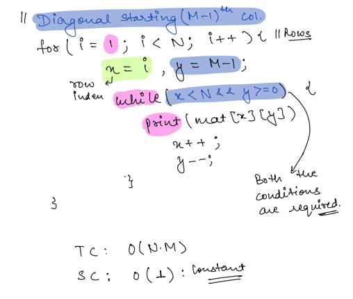
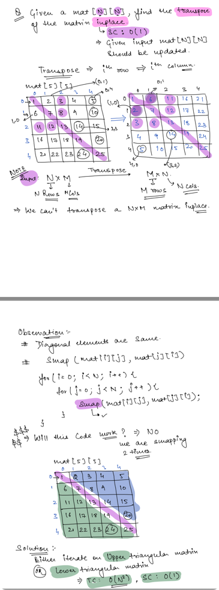
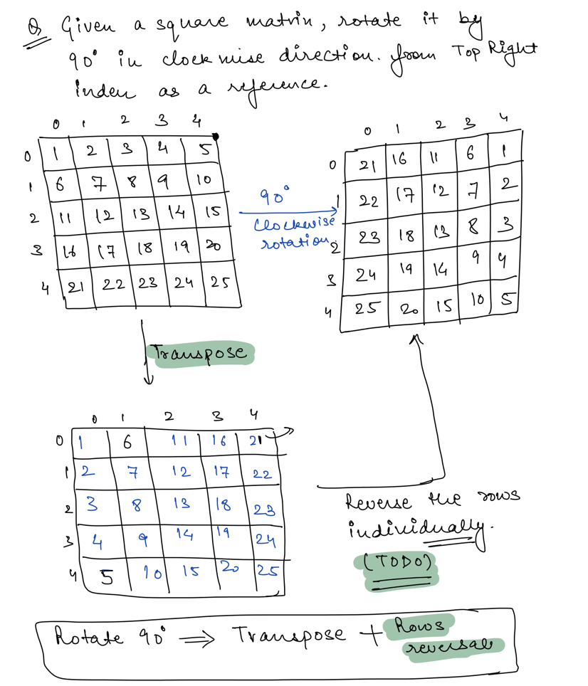

## Arrays : 2D Matrices

Matrices are series of series of scalars, or series of vectors. In code, they are typically stored as an array of
arrays.

```sql
int matrix[]= new int[3,3]

[
    [1,2,3],
    [4,5,6],
    [7,8,9]
]

```

#### Scalars

Scalars are simply numbers. For example, 2 is a scalar. So is 3.14159 and 1.618. And so is -273.15. Bonus points if you
can figure out what those numbers are special for.

#### Vectors

Vectors are series of scalars. For example, [1, 3, 5, 7, 9] is a vector. You typically store vectors as an array.

### 2D Matrix



### Problem 1 - Print Row Wise Sum



### Problem 2 - Max Column Sum



### Problem 3 - Print Square Matrix Diagonals



### Problem 4 - Print all Diagonals from Right -> Left

**Problem Understanding**

**Observation**

**Solution**


### Transpose Matrix



### Rotate Matrix



**Refer:**
[2D Matrix](https://github.com/santosh-1987/RubyScripts/blob/master/Scaler/two_dimensional_matrix.rb)
[Rotate Matrix ](https://github.com/santosh-1987/RubyScripts/blob/master/Scaler/rotate_matrix.rb)
[Spiral Array](https://github.com/santosh-1987/RubyScripts/blob/master/Scaler/spiral_array.rb)

###