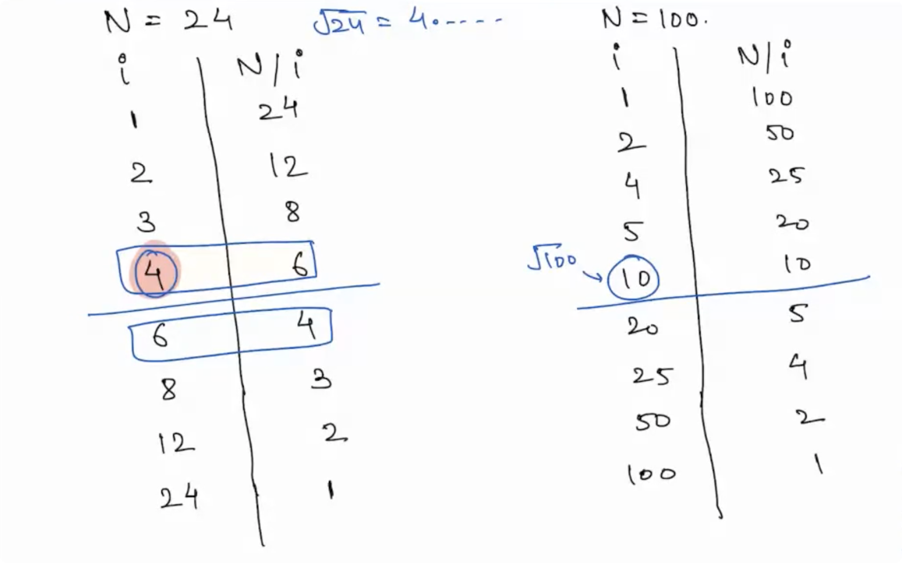

## Problem Solving

- As a Great Problem Solver we need to observe some basic things and optimize the Solution
- Develop the art of Observation/Intuition.

## Problems

- Given a Number check whether it is Prime or not?
    - This solution counts the number of factor and then returns true / false
      

```
Any Positive number that has 2 factors, 1 and the number itself

1 is not a Prime Number nor composite number(number having more than 2 factors)
2 is a Even Prime Number

if a Number a is exactly divisible by number b then we call the b is a factor of a
a*b = N , a and b are factors of N

Factors of a Number always exist in Pair.

```




- Sum of N Natural Numbers
  - (N*(N+1))/2
  - 
  - 
## Assumptions

- A system can run 10<sup>8</sup> Iterations in 1 Sec.
    - 10<sup>9</sup> Iterations = ( 1/10<sup>8</sup>) * 10<sup>9</sup> => 10 Sec
    - 10<sup>18</sup> Iterations = 10<sup>18</sup>/10<sup>8</sup> = 10<sup>10</sup> Sec