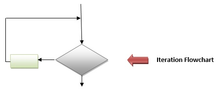

## Iteration / Repetition

Iteration logic is also known as Loop.
Iteration logic is used when one or more instructions may be executed several times depending on some condition.

- Iteration comes from the word “reiterate”, which means to repeat
- Iteration is a looping construct
- Iteration is a combination of decision and sequence and can repeat steps
- Iteration can be thought of as “while something is true, do this, otherwise stop”

#### Code logic
 - for..
 - while..
 - do-while..
 - recursion..
 - anything that loops

