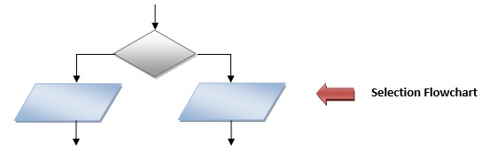
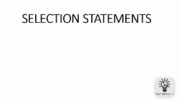

## Selection

Selection logic, also known as **decision logic**, is used for making decisions.

Selection logic is depicted as either an `IF…THEN…ELSE` or `IF…..THEN` structure.

- Selection is the decision-making construct.
- It is used to make yes/no or true/false decisions logically.
- Selection can be thought of as “if something is true, take this action, otherwise take that action”.

