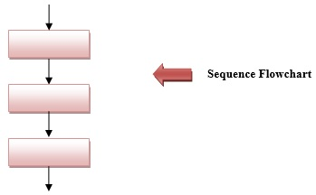
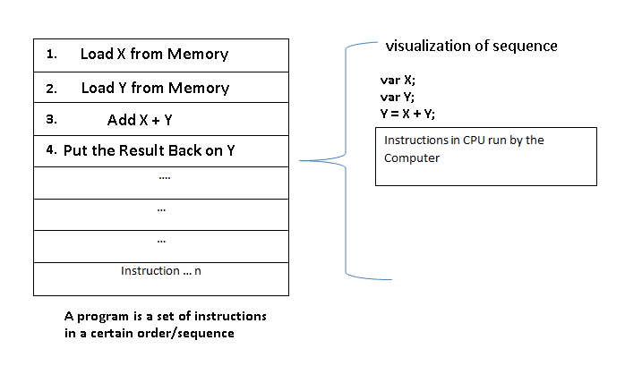

## Sequence
A sequence construct tells the processor which statement is to be executed next.

In programming languages, this is the **_statement following the current statement or first statement_** in the program. In other words, this is the very basic construct of writing a program. You just write line by line what you have in mind (of-course related to programming).

- Sequence is the most basic of the constructs
- It is simply performing one step after another
- Each step is followed in a specific sequence, hence the name
- Sequence can be thought of as “do this, then do this, then do this”

