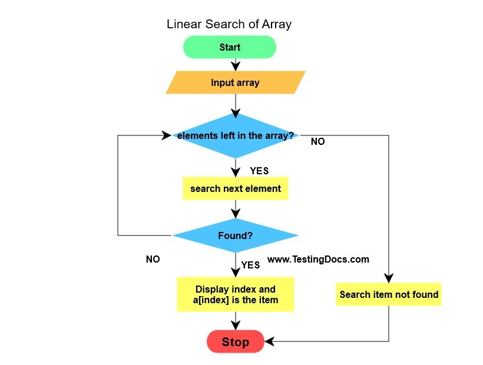

## Linear Search

A linear search or sequential search is a method for finding an element within a list. This type of searching algorithms sequentially checks each element of the list until a match is found or the whole list has been searched.

A linear search runs in at worst linear time and makes at most n comparisons, where n is the length of the list.

If each element is equally likely to be searched, then linear search has an average case of `n+1/2` comparisons, but the average case can be affected if the search probabilities for each element vary.


####Linear search of array
  


##### Let us understand this with an example:

```
Problem: Given an array arr[] of n elements, write a function to search a given element x in arr[].
```

```
Examples-

Input : arr[] = {10, 20, 80, 30, 60, 50,
110, 100, 130, 170}
x = 110;
Output : 6
Element x is present at index 6

Input : arr[] = {10, 20, 80, 30, 60, 50,
110, 100, 130, 170}
x = 175;
Output : -1
Element x is not present in arr[].
A simple approach is to do linear search, i.e

```

###### Solution
>Start from the leftmost element of arr[] and one by one compare x with each element of arr[]
If x matches with an element, return the index.
If x doesn’t match with any of elements, return -1.
Linear search

Example of Linear Search in Java

```java
class GFG  
{  
    public static int search(int arr[], int x) {
        int n = arr.length;
            for(int i = 0; i < n; i++) {
                if(arr[i] == x)
                    return i;
            }
        return -1;
    }

    public static void main(String args[]) {
        int arr[] = { 2, 3, 4, 10, 40 };  
        int x = 10;
        int result = search(arr, x); 
        if(result == -1) {
            System.out.print("Element is not present in array"); 
        }    
        else {
            System.out.print("Element is present at index " + result); 
       }
    }   
}
```

_**The time complexity of above algorithm is O(n).**_