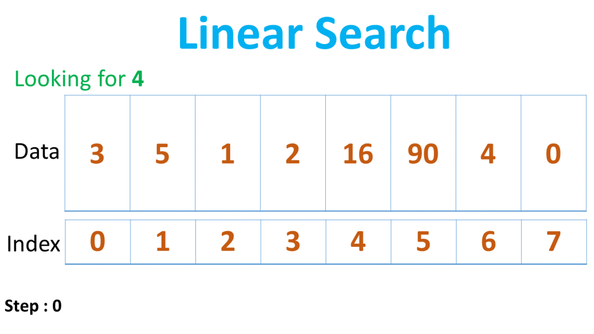
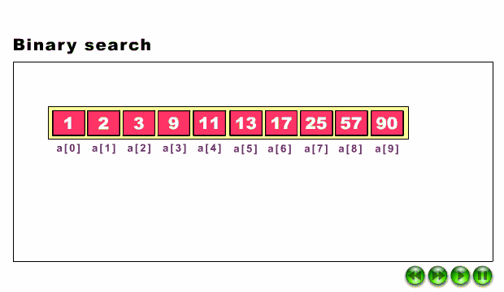

## Searching Techniques

Searching Algorithms are designed to check for an element or retrieve an element from any data structure where it is stored.

Based on the type of search operation, these algorithms are generally classified into two categories:

 - **Sequential Search** (Linear Search)

    

 - **Interval Search** (Binary Search)

   

##### Sequential vs Interval Search

  

##### _Searching may be sequential or not_
> If the data in the dataset are random, then we need to use sequential searching. Otherwise we can use other different techniques to reduce the complexity.

| Search Type                        | Definition |
|------------------------------------| ---- |
| [Linear Search ](linear-search.md) |Items are searched one by one|
| [Binary Search](#)                 | The entire list is divided into two sub-lists. If the item is found in the middle position, it returns the location, otherwise jumps to either left or right sub-list and do the same process again until finding the item or exceed the range|
| [Exponential Search](#)            | This mechanism is used to find the range where the search key may present|
| [Interpolation Search](#)          | This procedure will try to locate the exact position using interpolation formula|
| [Jump Search](#)                   | Jump search technique also works for ordered lists. It creates a block and tries to find the element in that block. If the item is not in the block, it shifts the entire block|
| [Ternary Search](#)                | This procedure divides the list into three parts using two intermediate mid values. As the lists are divided into more subdivisions, so it reduces the time to search a key value.|
