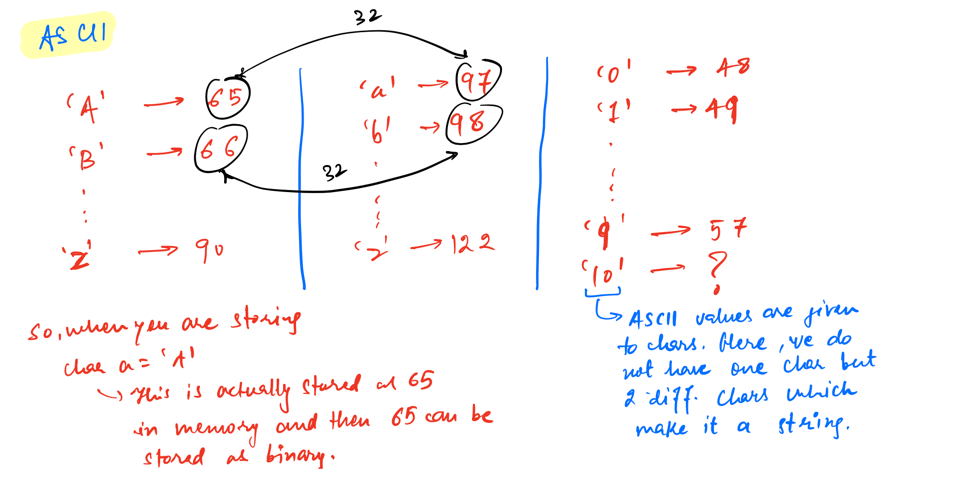

## Strings

String is defined as `Sequence` of characters, `Group` of characters, `Array` of characters, `List` of characters

What is a Character? Character is a Datatype which stores data in fixed length field. e.g `a`, `A`, `z`, `|`

### How does computer stores strings?

Since computer only understand binary, hence they can only store number, So computers have mapping of character into
numbers.

### Mutability?

/ liability or tendency to change /

- The mutable objects are objects whose value can be changed after initialization.
- The immutable objects are objects whose value cannot be changed after initialization.

In `Java` Strings are Immutable, In `Ruby` Strings are Mutable for version < 3.0

### Why are String objects immutable?

- As applications grow, it’s very common for String literals to occupy a large area of memory, which can even cause
  redundancy. So, in order to make Java more efficient, the JVM sets aside a special area of memory called the “String
  constant pool”.
- The String constant pool is a special memory area. When we declare a String literal, the JVM creates the object in the
  pool and stores its reference on the stack. Before creating each String object in memory, the JVM performs some steps
  to decrease the memory overhead.

### Difference between StringBuffer and StringBuilder

Java provides three classes to represent a sequence of characters: String, StringBuffer, and StringBuilder. The String
class is an immutable class whereas StringBuffer and StringBuilder classes are mutable.

| No. |    StringBuffer|    StringBuilder|
|----|----|----|
| 1  |    StringBuffer is synchronized i.e. thread safe. It means two threads can't call the methods of StringBuffer simultaneously.    |StringBuilder is non-synchronized i.e. not thread safe. It means two threads can call the methods of StringBuilder simultaneously.|
| 2  |    StringBuffer is less efficient than StringBuilder.|    StringBuilder is more efficient than StringBuffer.|
| 3  |    StringBuffer was introduced in Java 1.0|    StringBuilder was introduced in Java 1.5|

### Tips

- The difference between Uppercase and lower case character is 32

### Problems:

- Given a String, Toggle a case of every characters
    - "abCdeF" => "ABcDEf"
        - Hint: Use Bit manipulation to toggle the bits at 5th place.
- Given a String Sort the string in Dictonary order
    - "dabaedb" => "aabbdde"
- Given a String , Reverse the String
- Given a String , Reverse the substring from index x till y
- Given a String , Reverse the String word by word
    - "here is a picture" => "picture a is here"
- Given a String find the Longest Palliandromic Substring
    - "abacab" # O/P -> 5 {bacab}

### Solutions

- [String Programs & Code Snippets](https://github.com/santosh-1987/RubyScripts/tree/master/Scaler/strings)
- [Practice Problems](https://youtube.com/playlist?list=PLqM7alHXFySE_Pxx_HsUSZGwiLpv9ziWA)